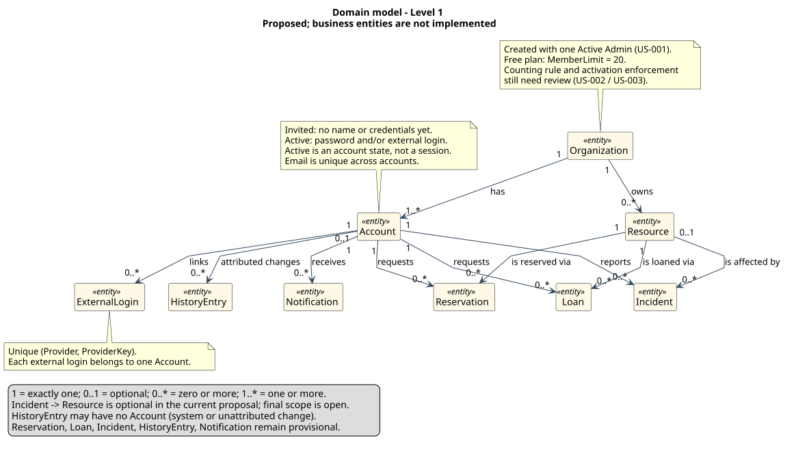
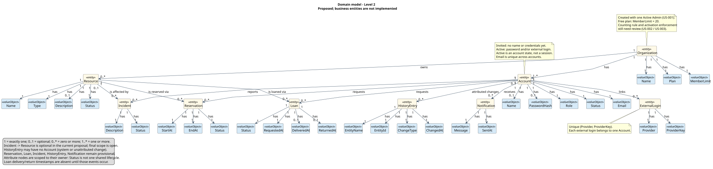
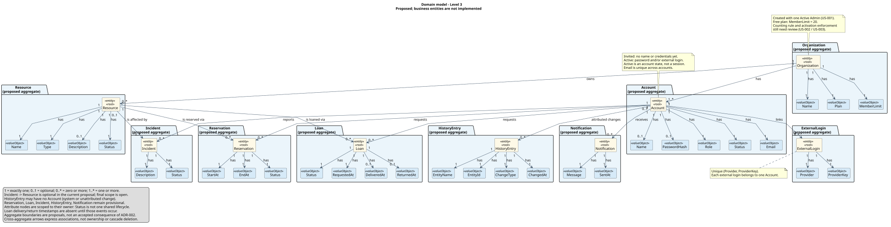

# Domain models

[Documentation index](../README.md)

Describe business concepts independently of database tables and implementation classes.

## Rationale

Domain concepts and their associations are identified from the requirements' [goals](../requirements/README.md#context-and-scope) and the [glossary](../glossary/README.md): nouns become concepts, verbs become associations. Every association below also appears in the per-area tables further down, grouped by feature area with its own status and open questions; this table gives the whole-domain view in one place, matching the [domain model diagrams](#domain-model-diagrams).

| Concept (A) | Association | Concept (B) |
| --- | --- | --- |
| Organization | has | Name |
| Organization | has | Plan |
| Organization | has | MemberLimit |
| Organization | has | Account |
| Organization | has | Resource |
| Account | belongs to | Organization |
| Account | has | Email |
| Account | has | Name |
| Account | has | PasswordHash |
| Account | has | Role |
| Account | has | Status |
| Account | has | ExternalLogin |
| ExternalLogin | belongs to | Account |
| ExternalLogin | has | Provider |
| ExternalLogin | has | ProviderKey |
| Resource | belongs to | Organization |
| Resource | has | Name |
| Resource | has | Type |
| Resource | has | Description |
| Resource | has | Status |
| Resource | is reserved via | Reservation |
| Resource | is loaned via | Loan |
| Resource | is affected by | Incident |
| Reservation | requested by | Account |
| Reservation | has | StartAt |
| Reservation | has | EndAt |
| Reservation | has | Status |
| Loan | requested by | Account |
| Loan | has | Status |
| Loan | has | RequestedAt |
| Loan | has | DeliveredAt |
| Loan | has | ReturnedAt |
| Incident | reported by | Account |
| Incident | has | Description |
| Incident | has | Status |
| HistoryEntry | attributed to | Account (optional) |
| HistoryEntry | has | EntityName |
| HistoryEntry | has | EntityId |
| HistoryEntry | has | ChangeType |
| HistoryEntry | has | ChangedAt |
| Notification | belongs to | Account |
| Notification | has | Message |
| Notification | has | SentAt |

## Accounts and organizations

**Scope:** Organization, account creation, and sign-in ([US-001](../requirements/US-001-create-organization-admin.md), [US-002](../requirements/US-002-register-member-email.md), [US-003](../requirements/US-003-create-member-account.md), [US-005](../requirements/US-005-sign-in.md)).
**Status:** proposed.
**Diagram:** [Domain model diagrams](#domain-model-diagrams).

| Concept | Meaning | Relationships | Business rules |
| --- | --- | --- | --- |
| Organization | A single association using the system (per [glossary](../glossary/README.md)) | Has one admin Account (the creator) and member Accounts (0..*, `Invited` or `Active`); has Resources (0..*) | Starts on the "Free" plan (limit: 20 **active** member accounts) on creation |
| Account | A synthetic identity, either invited and pending (`Status = Invited`, no credentials) or signed into the system (`Status = Active`) | Belongs to exactly one Organization; has role "admin" or "member"; has 0..* ExternalLogins | Created directly `Active` with role "admin" via organization creation (US-001); created `Invited` with role "member" by an admin (US-002), then becomes `Active` once the person sets credentials (US-003); an `Active` account must have a password, at least one ExternalLogin, or both; only `Active` accounts count toward the organization's plan limit |
| ExternalLogin | A link between an Account and a social provider identity (per [glossary](../glossary/README.md)) | Belongs to exactly one Account | Unique per (Provider, ProviderKey); the provider's email must match the Account's email at creation time |

**Assumptions and open questions:**

- Only one admin per organization is assumed for now (the creator). Whether additional admins can be promoted later is open.
- Plan tiers beyond "Free" (e.g., up to 50, unlimited) are named in conversation but not yet specified as enforced rules; only the Free limit (20 active accounts) is a confirmed business rule so far.
- Per [ADR-006](../decisions/ADR-006-authentication.md), an SSO-only Account has no password; whether a user can later add a password to an SSO-only account is open.
- An `Account` was previously modeled with a separate `EligibleEmail` concept for the not-yet-activated state; that was folded into `Account.Status` (`Invited`/`Active`), since an invited email already *is* the future account, not a distinct thing consumed by it.
- Whether an `Invited` account can be re-invited (e.g., the admin registers the same email again while it's still pending) is open; currently any existing account for the email, `Invited` or `Active`, blocks a new invite (US-002).

## Resources

**Scope:** Resource registration and lifecycle ([US-004](../requirements/US-004-register-resource.md)).
**Status:** proposed.
**Diagram:** [Domain model diagrams](#domain-model-diagrams).

| Concept | Meaning | Relationships | Business rules |
| --- | --- | --- | --- |
| Resource | A room, tool, or piece of equipment the association manages (per [glossary](../glossary/README.md)) | Belongs to exactly one Organization; will be reserved (0..*) via Reservation, borrowed (0..*) via Loan, and affected (0..*) by Incident, once those areas are modeled | Must have a name and a type; starts in status "Available" on registration |

**Assumptions and open questions:**

- Does a resource need a unique code/identifier, or is the name alone sufficient? Not yet decided.
- Can two physically identical resources (e.g., two projectors) be registered as separate entries, or does one entry represent a quantity? Assumed separate entries for now, since reservations and loans target one specific item.

## Reservations and loans

**Scope:** Resource booking and lending lifecycle (requirements goals: "reservation and cancellation", "loan request, delivery, and return"). No user story has been written for this area yet.
**Status:** proposed.
**Diagram:** [Domain model diagrams](#domain-model-diagrams).

| Concept | Meaning | Relationships | Business rules |
| --- | --- | --- | --- |
| Reservation | A commitment of a Resource for a period (per [glossary](../glossary/README.md)) | Belongs to exactly one Resource; requested by exactly one Account | Only valid when the resource is available and eligible for the requested period; the exact availability/conflict rule is not yet decided |
| Loan | The request, delivery, and return cycle of a Resource to a member (per [glossary](../glossary/README.md)) | Belongs to exactly one Resource; requested by exactly one Account | Moves through a request, delivery, and return; the exact status set and cancellation rules are not yet decided |

**Assumptions and open questions:**

- No user story defines reservations or loans yet; the fields above are provisional pending those definitions.
- Whether a Resource with quantity > 1 (see [Resources](#resources) open question) allows overlapping Reservations is open.
- Cancellation rules for a Reservation (who can cancel, and by when) are not yet specified.

## Incidents

**Scope:** Incident lifecycle affecting a Resource (requirements goal: "incident communication, handling, and closure"). No user story has been written for this area yet.
**Status:** proposed.
**Diagram:** [Domain model diagrams](#domain-model-diagrams).

| Concept | Meaning | Relationships | Business rules |
| --- | --- | --- | --- |
| Incident | A reported problem affecting a resource, room, safety, or stock (per [glossary](../glossary/README.md)) | Belongs to 0..1 Resource; reported by exactly one Account | Tracked from report to verified resolution, or reopened if unresolved; the exact status set is not yet decided |

**Assumptions and open questions:**

- No user story defines incident reporting yet.
- The glossary defines an Incident more broadly than "affecting a Resource" (it also names room, safety, and stock issues); whether every Incident must reference a specific Resource, or can stand alone, is open.

## History and notifications

**Scope:** The audit trail and the one simulated notification (requirements goals: "history sufficient to reconstruct relevant changes", "one scheduled job and one simulated notification"). No user story has been written for this area yet.
**Status:** proposed.
**Diagram:** [Domain model diagrams](#domain-model-diagrams).

| Concept | Meaning | Relationships | Business rules |
| --- | --- | --- | --- |
| HistoryEntry | A record of a change to a tracked entity, sufficient to reconstruct it | References the changed entity by name and id; attributed to the Account that made the change, when known | Append-only; never updated or deleted |
| Notification | A simulated message sent to an Account | Belongs to exactly one Account | Simulated only, per the "one simulated notification" goal; no real delivery channel is integrated |

**Assumptions and open questions:**

- Which entities and fields count as "relevant changes" worth recording is not yet decided; assumed to include at least Reservation, Loan, and Incident status transitions once those areas are built.
- What triggers the one scheduled job and the one simulated notification, and how the two relate, is not yet decided.

## Domain model diagrams

One conceptual domain model for the whole system, at three levels of detail:

- **Level 1:** concepts and their associations only.
- **Level 2:** adds each concept's attributes, as value objects.
- **Level 3:** groups each concept and its attributes into a DDD aggregate, per [ADR-002](../decisions/ADR-002-modular-monolith-architecture.md)'s layered structure.

### Level 1

### Level 2

### Level 3

## Model template

**Scope:** [business area and related requirements].
**Status:** [proposed / accepted].
**Diagram:** [add a conceptual model with named relationships and multiplicities].

| Concept | Meaning | Relationships | Business rules |
| --- | --- | --- | --- |
| [Concept] | [Definition] | [Related concepts and multiplicities] | [Invariants] |

**Assumptions and open questions:** [unresolved domain questions].

Use the [glossary](../glossary/README.md) for terminology. Document persistence mappings separately in [database design](../database/README.md). Add one named model file per business area when needed.
