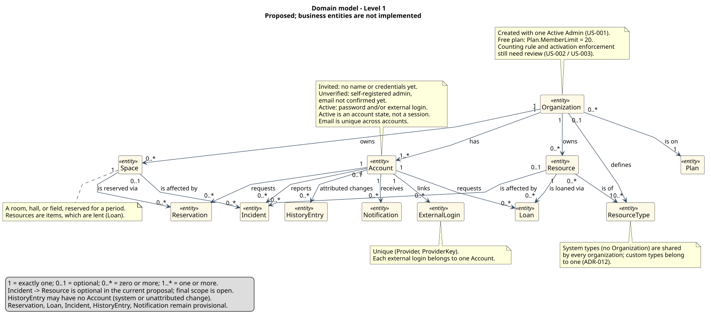
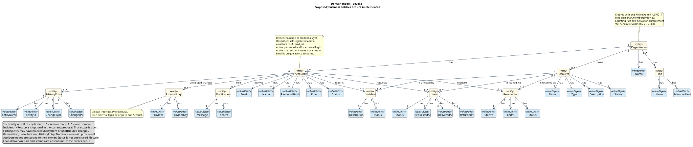
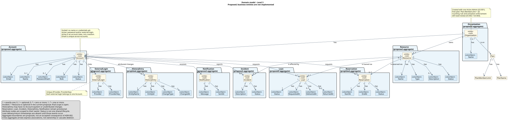

# Domain models

[Documentation index](../README.md)

These proposed models describe business concepts independently of database tables and implementation classes. Only `Organization`, `Account`, `Plan`, `ExternalLogin`, `Resource`, and `ResourceType` are implemented (US-001 to US-005 and US-004 backend); the rest are proposed. Consult the [design review gaps](../requirements/README.md#design-review-gaps) for unresolved cross-story rules.

## Rationale

Domain concepts and their associations are identified from the requirements' [goals](../requirements/README.md#context-and-scope) and the [glossary](../glossary/README.md): nouns become concepts, verbs become associations. Every association below also appears in the per-area tables further down, grouped by feature area with its own status and open questions; this table gives the whole-domain view in one place, matching the [domain model diagrams](#domain-model-diagrams).

| Concept (A) | Association | Concept (B) |
| --- | --- | --- |
| Organization | has | Name |
| Organization | is on | Plan |
| Plan | has | Name |
| Plan | has | MemberLimit |
| Plan | has | ResourceLimit |
| Plan | has | MonthlyPrice |
| Plan | has | IncludedFeatures |
| Organization | has | Account |
| Organization | has | Resource |
| Account | belongs to | Organization |
| Account | has | Email |
| Account | has | Name |
| Account | has | PasswordHash |
| Account | has | Role |
| Account | has | Status |
| Account | has | ExternalLogin |
| ExternalLogin | belongs to | Account |
| ExternalLogin | has | Provider |
| ExternalLogin | has | ProviderKey |
| Resource | belongs to | Organization |
| Resource | has | Name |
| Resource | is of | ResourceType |
| Organization | defines | ResourceType |
| ResourceType | has | Name |
| Resource | has | Description |
| Resource | has | Status |
| Organization | has | Space |
| Space | has | Name |
| Space | is reserved via | Reservation |
| Space | is affected by | Incident |
| Resource | is loaned via | Loan |
| Resource | is affected by | Incident |
| Reservation | requested by | Account |
| Reservation | has | StartAt |
| Reservation | has | EndAt |
| Reservation | has | Status |
| Loan | requested by | Account |
| Loan | has | Status |
| Loan | has | RequestedAt |
| Loan | has | DeliveredAt |
| Loan | has | ReturnedAt |
| Incident | reported by | Account |
| Incident | has | Description |
| Incident | has | Status |
| HistoryEntry | attributed to | Account (optional) |
| HistoryEntry | has | EntityName |
| HistoryEntry | has | EntityId |
| HistoryEntry | has | ChangeType |
| HistoryEntry | has | ChangedAt |
| Notification | belongs to | Account |
| Notification | has | Message |
| Notification | has | SentAt |

## Accounts and organizations

**Scope:** Organization, account creation, and sign-in ([US-001](../requirements/US-001-create-organization-admin.md), [US-002](../requirements/US-002-register-member-email.md), [US-003](../requirements/US-003-create-member-account.md), [US-005](../requirements/US-005-sign-in.md)).
**Status:** `Organization`, `Plan`, `Account`, and `ExternalLogin` implemented; social sign-in creates no account, and social account creation (US-001, US-003) is not implemented.
**Diagram:** [Domain model diagrams](#domain-model-diagrams).

| Concept | Meaning | Relationships | Business rules |
| --- | --- | --- | --- |
| Organization | A single association using the system (per [glossary](../glossary/README.md)) | Has one admin Account (the creator) and member Accounts (0..*, `Invited` or `Active`); has Resources (0..*); is on exactly one Plan | Starts on the "Free" plan on creation |
| Plan | A subscription tier defining the limits and included functionality an Organization on it is subject to (per [glossary](../glossary/README.md)) | Has Organizations (0..*) | Has a unique name, a member limit (the maximum number of **active** member accounts), and a resource limit (the maximum number of Resources the organization can register); a limit of `Unlimited` means uncapped. Has a display-only monthly price (null means a custom/"contact us" plan; plans are simulated, no real billing). Has five feature flags marking which of the app's functionality areas it includes: incident tracking, expense tracking, decision history, AI-powered insights, priority support, plus a sixth, custom resource types (Team and Enterprise, [ADR-012](../decisions/ADR-012-resource-types.md)); space & equipment bookings is included on every tier, so it is not a flag. None of these five areas are implemented yet, so the flags are pricing-page data only, not an enforced entitlement check. Plan rules live on the Plan, not on the Organization |
| Account | A synthetic identity, either invited and pending (`Status = Invited`, no credentials), a self-registered admin whose email is not confirmed yet (`Status = Unverified`), or activated (`Status = Active`, independently of any current session) | Belongs to exactly one Organization; has role "admin", "member", or "staff"; has 0..* ExternalLogins | Created `Unverified` with role "admin" via organization creation with a password, becoming `Active` once the emailed link confirms the email, or directly `Active` via Google (US-001); only an `Active` account can sign in or be linked to a social login, and an `Active` account can be locked after 5 wrong passwords until its owner uses the emailed unlock link ([ADR-010](../decisions/ADR-010-account-security-hardening.md)); created `Invited` with role "member" or "staff" by an admin (US-002), then becomes `Active` once the person sets credentials (US-003); an `Active` account must have a password, at least one ExternalLogin, or both; `Active` accounts count toward the organization's plan limit, and a new invitation also counts pending `Invited` ones; the email is trimmed and lowercased before storage and lookup (so it is compared case-insensitively) and is unique across accounts; dots and `+tags` are not altered |
| ExternalLogin | A link between an Account and a social provider identity (per [glossary](../glossary/README.md)) | Belongs to exactly one Account | Unique per (Provider, ProviderKey); linked on first social sign-in (US-005) to the `Active` account whose email equals the provider's verified email; later sign-ins match on the (Provider, ProviderKey) pair, not the email |

**Assumptions and open questions:**

- Only one admin per organization is assumed for now (the creator). Whether additional admins can be promoted later is open.
- Three tiers are seeded: Free (member limit 20, resource limit 10), Team (member limit 100, resource limit 100), Enterprise (both unlimited). Whether further tiers or per-tier feature flags (beyond these two numeric limits) are needed is open.
- Per [ADR-006](../decisions/ADR-006-authentication.md), an SSO-only Account has no password; whether a user can later add a password to an SSO-only account is open.
- An `Account` was previously modeled with a separate `EligibleEmail` concept for the not-yet-activated state; that was folded into `Account.Status` (`Invited`/`Active`), since an invited email already *is* the future account, not a distinct thing consumed by it.
- Whether an `Invited` account can be re-invited (e.g., the admin registers the same email again while it's still pending) is open; currently any existing account for the email, `Invited` or `Active`, blocks a new invite (US-002).

## Resources

**Scope:** Resource registration and lifecycle ([US-004](../requirements/US-004-register-resource.md)).
**Status:** `Resource` and `ResourceType` implemented (US-004 backend); the lifecycle beyond registration is proposed.
**Diagram:** [Domain model diagrams](#domain-model-diagrams).

| Concept | Meaning | Relationships | Business rules |
| --- | --- | --- | --- |
| Resource | An item the association lends: equipment, a utensil, a vehicle (per [glossary](../glossary/README.md)); not a space | Belongs to exactly one Organization; is of exactly one ResourceType; will be borrowed (0..*) via Loan and affected (0..*) by Incident, once those areas are modeled | Must have a name and a type the organization can use; starts in status "Available" on registration; only an admin or staff account registers it; an organization cannot hold more resources than its plan's resource limit |
| ResourceType | A kind of resource ([ADR-012](../decisions/ADR-012-resource-types.md)) | A system type belongs to no Organization and is shared by all; a custom type belongs to exactly one Organization | System types are `Equipment`, `Utensil`, `Vehicle`, `Other`; names are unique among system types and per organization among custom types; custom types need a plan with custom resource types, and managing them is a later story |

**Assumptions and open questions:**

- Does a resource need a unique code/identifier, or is the name alone sufficient? Not yet decided.
- Can two physically identical resources (e.g., two projectors) be registered as separate entries, or does one entry represent a quantity? Assumed separate entries for now, since loans target one specific item.

## Spaces

**Scope:** Space registration and reservations ([US-007](../requirements/US-007-register-space.md), draft).
**Status:** proposed.
**Diagram:** [Domain model diagrams](#domain-model-diagrams).

| Concept | Meaning | Relationships | Business rules |
| --- | --- | --- | --- |
| Space | A room, hall, or field the association books out for periods (per [glossary](../glossary/README.md)); not a resource | Belongs to exactly one Organization; reserved (0..*) via Reservation; affected (0..*) by Incident | Must have a name; the other fields (capacity, location, opening hours) and whether spaces have types are open until US-007 is designed |

**Assumptions and open questions:**

- Spaces were first modeled as a resource type (`Room`); they were split out because they are reserved for periods while resources are lent, and the Figma screens keep them in separate sections.
- Whether a reservation can also ask for resources (the Figma reservation dialog lists "equipment needed") is open.
- Whether spaces count toward the plan's resource limit, or get their own limit, is open.

## Reservations and loans

**Scope:** Resource booking and lending lifecycle (requirements goals: "reservation and cancellation", "loan request, delivery, and return"). No user story has been written for this area yet.
**Status:** proposed.
**Diagram:** [Domain model diagrams](#domain-model-diagrams).

| Concept | Meaning | Relationships | Business rules |
| --- | --- | --- | --- |
| Reservation | A commitment of a Space for a period (per [glossary](../glossary/README.md)) | Belongs to exactly one Space; requested by exactly one Account | Only valid when the space is available and eligible for the requested period; the exact availability/conflict rule is not yet decided |
| Loan | The request, delivery, and return cycle of a Resource to a member (per [glossary](../glossary/README.md)) | Belongs to exactly one Resource; requested by exactly one Account | Moves through a request, delivery, and return; the exact status set and cancellation rules are not yet decided |

**Assumptions and open questions:**

- No user story defines reservations or loans yet; the fields above are provisional pending those definitions.
- Whether a Resource with quantity > 1 (see [Resources](#resources) open question) allows overlapping Loans is open.
- Cancellation rules for a Reservation (who can cancel, and by when) are not yet specified.

## Incidents

**Scope:** Incident lifecycle affecting a Resource (requirements goal: "incident communication, handling, and closure"). No user story has been written for this area yet.
**Status:** proposed.
**Diagram:** [Domain model diagrams](#domain-model-diagrams).

| Concept | Meaning | Relationships | Business rules |
| --- | --- | --- | --- |
| Incident | A reported problem affecting a resource, a space, safety, or stock (per [glossary](../glossary/README.md)) | Belongs to 0..1 Resource or 0..1 Space; reported by exactly one Account | Tracked from report to verified resolution, or reopened if unresolved; the exact status set is not yet decided |

**Assumptions and open questions:**

- No user story defines incident reporting yet.
- The glossary defines an Incident more broadly than "affecting a Resource" (it also names space, safety, and stock issues); whether every Incident must reference a specific Resource, or can stand alone, is open.

## History and notifications

**Scope:** The audit trail and the one simulated notification (requirements goals: "history sufficient to reconstruct relevant changes", "one scheduled job and one simulated notification"). No user story has been written for this area yet.
**Status:** proposed.
**Diagram:** [Domain model diagrams](#domain-model-diagrams).

| Concept | Meaning | Relationships | Business rules |
| --- | --- | --- | --- |
| HistoryEntry | A record of a change to a tracked entity, sufficient to reconstruct it | References the changed entity by name and id; attributed to the Account that made the change, when known | Append-only; never updated or deleted |
| Notification | A simulated message sent to an Account | Belongs to exactly one Account | Simulated only, per the "one simulated notification" goal; no real delivery channel is integrated |

**Assumptions and open questions:**

- Which entities and fields count as "relevant changes" worth recording is not yet decided; assumed to include at least Reservation, Loan, and Incident status transitions once those areas are built.
- What triggers the one scheduled job and the one simulated notification, and how the two relate, is not yet decided.

## Domain model diagrams

One conceptual domain model for the whole system, at three levels of detail:

- **Level 1:** concepts and their associations only.
- **Level 2:** adds each concept's attributes as separately drawn value objects, scoped to their owner. For example, Account.Status and Resource.Status are different lifecycles even though both are labeled `Status`.
- **Level 3:** retains the proposed aggregate grouping and roots. [ADR-002](../decisions/ADR-002-modular-monolith-architecture.md) selects a layered monolith; it does not decide aggregate boundaries. Those boundaries still need review before implementation, particularly ExternalLogin's relationship to Account.

The three levels use the same entity associations and multiplicities. Attribute nodes express conceptual values, not a decision to implement a separate C# class or database table for each value. Arrows across aggregate boundaries do not imply composition, cascade deletion, or a shared transaction.

| Association or value | Multiplicity | Basis or limitation |
| --- | --- | --- |
| Organization → Account | One organization has `1..*` accounts; each account belongs to one organization | US-001 creates the organization and its admin atomically; exactly one admin is the current assumption |
| Account → ExternalLogin | `0..*` logins per account; one account per login | Invited and password-only accounts may have none; provider/key pair is unique |
| Account.FirstName / LastName / PasswordHash | `0..1` each | Invited accounts lack all three; active SSO-only accounts lack a password hash |
| Account invitation link token and code | `0..1` each | Implementation detail not drawn in the diagrams: two separate hashed one-time secrets present only while the account is `Invited` (US-002/US-003), a long link token embedded in the email's URL and a short code shown only in the email body, both required to activate |
| Resource.Description | `0..1` | Optional in US-004 |
| Resource → Incident | `0..*` incidents per resource; `0..1` resource per incident | Matches the current provisional table; whether standalone incidents remain supported is open |
| Account → HistoryEntry | `0..*` entries per account; `0..1` attributed account per entry | Allows system or unattributed changes |
| Loan.DeliveredAt / ReturnedAt | `0..1` each | Provisional lifecycle interpretation: absent until delivery/return; final rules await a story |

All other existing domain associations are preserved. Detailed status sets, plan-limit counting, and persistence constraints remain in the per-area open questions and [design review gaps](../requirements/README.md#design-review-gaps).

### Level 1

### Level 2

### Level 3

## Model template

**Scope:** [business area and related requirements].
**Status:** [proposed / accepted].
**Diagram:** [add a conceptual model with named relationships and multiplicities].

| Concept | Meaning | Relationships | Business rules |
| --- | --- | --- | --- |
| [Concept] | [Definition] | [Related concepts and multiplicities] | [Invariants] |

**Assumptions and open questions:** [unresolved domain questions].

Use the [glossary](../glossary/README.md) for terminology. Document persistence mappings separately in [database design](../database/README.md). Add one named model file per business area when needed.
