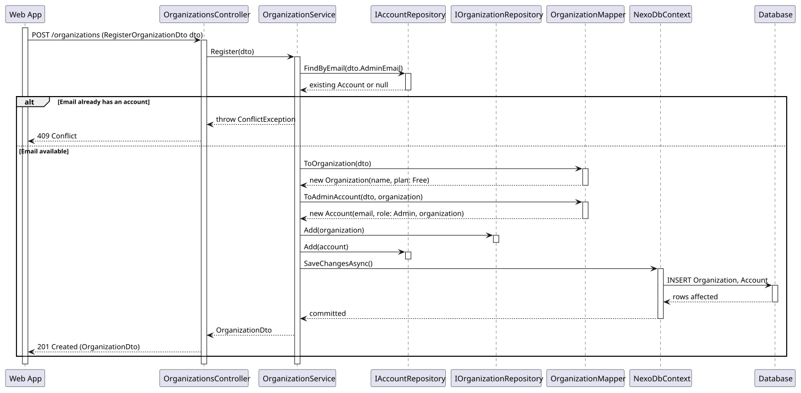
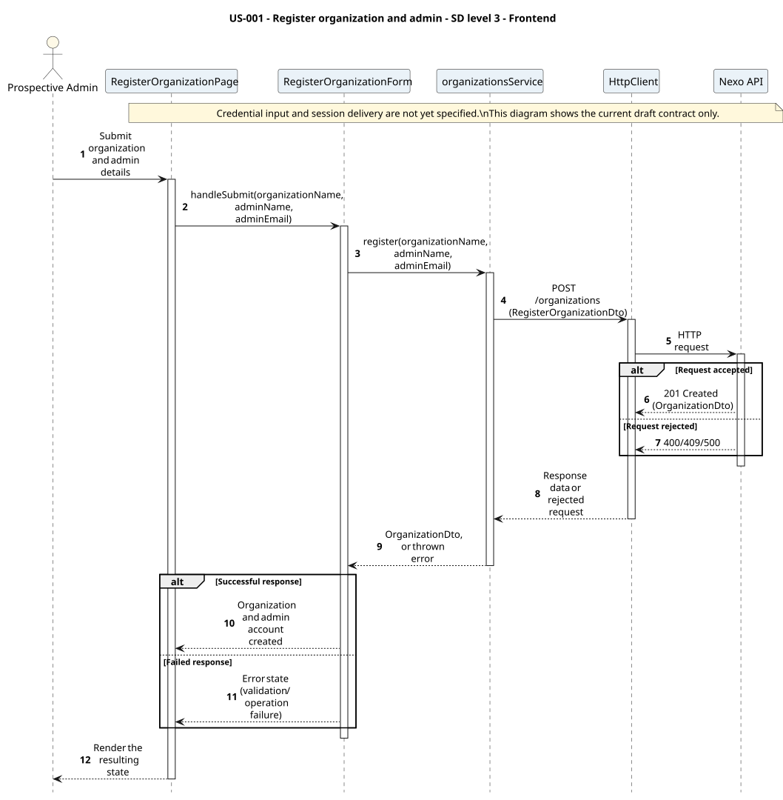

# US-001 - Create an organization and its admin account

[User story design index](../README.md) · [Requirement](../../requirements/US-001-create-organization-admin.md) · [HLD](../../requirements/US-001-HLD.md) · [LLD](../../requirements/US-001-LLD.md)

**Status:** proposed design; not implemented. Review the [open contract details](../../requirements/README.md#design-review-gaps) alongside these diagrams.

## Diagram scope

The SSD retains the required signed-in outcome, while SDs stop at the current OrganizationDto contract. Credential input, OAuth exchange, and session delivery remain unspecified; the diagrams do not invent them.

All diagrams are numbered and use explicit outcome branches. Backend SDs show input validation before reads, EF tracking separately from save, and persistence failure responses where the LLD defines them. Operation tables summarize the collaboration; their row numbers are not diagram message numbers.

## Level 1 - SSD

**Actor:** Prospective admin (no account yet).
**Preconditions:** None; this is the entry point.
**Trigger:** The prospective admin submits organization and admin account details.

| Step | Actor input | System response |
| --- | --- | --- |
| 1 | Organization and admin details | Organization and admin account created; signed in, or registration rejected |

**Alternative and failure flows:** Missing/invalid fields, or email already in use, reject with no organization or account created.
**Postconditions:** Organization and admin account exist; the admin is signed in.
**Diagram:** 

## Level 2 - SD (coarse)

**Participants:** `Web UI`, `Nexo API` (the backend, as a whole).
**Diagram:** 

## Level 3 - Backend

**Participants:** `Web App` (the frontend, as a whole), `OrganizationsController`, `OrganizationService`, `IAccountRepository`, `IOrganizationRepository`, `OrganizationMapper`, `NexoDbContext`, `Database`.
**Diagram:** 

| Step | Sender → receiver | Operation | Outcome |
| --- | --- | --- | --- |
| 1 | Web App → Controller | `POST /organizations` | Delegates to `OrganizationService.Register` |
| 2 | Service → AccountRepository | `FindByEmailAsync` | Checks the admin email is not already in use |
| 3 | Service → Mapper | `ToOrganization`, `ToAdminAccount` | Builds the domain `Organization` (Free plan) and admin `Account` |
| 4 | Service → repositories → DbContext → Database | `Add`, `SaveChangesAsync` | Persists both in one transaction |

**Failure handling:** An email already in use short-circuits before any persistence and returns a conflict to the controller.
Validation errors return 400 before repository access. A failed save returns 500 with no partial persisted write, as specified in the LLD; the detailed error body remains unspecified. The diagrams show response mapping only after a successful save.

**Transaction boundaries:** Organization and admin account are created together in a single `SaveChangesAsync` call; no partial state is possible.

## Level 3 - Frontend

**Participants:** `RegisterOrganizationPage`, `RegisterOrganizationForm`, `organizationsService`, `HttpClient`, `Nexo API` (the backend, as a whole).
**Diagram:** 

| Step | Sender → receiver | Operation | Outcome |
| --- | --- | --- | --- |
| 1 | Actor → View → Component | Submit organization and admin details | View forwards the actor's input to the form component |
| 2 | Component → Service | `organizationsService.register(...)` | Feature module builds the request |
| 3 | Service → HttpClient | `POST /organizations` | Shared Axios instance sends the request |
| 4 | HttpClient → Nexo API | HTTP request | Reaches the backend (detailed in [Level 3 - Backend](#level-3---backend)) |

**Failure handling:** A thrown error from the API call propagates back through the service to the component, which renders the validation or conflict message.
**Related design:** [Architecture](../../architecture/README.md), [Domain model](../../domain-models/README.md#accounts-and-organizations), [ADR-002](../../decisions/ADR-002-modular-monolith-architecture.md), [ADR-004](../../decisions/ADR-004-frontend-architecture.md).
