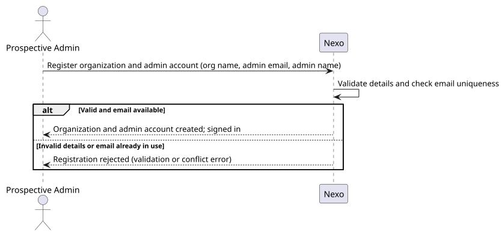
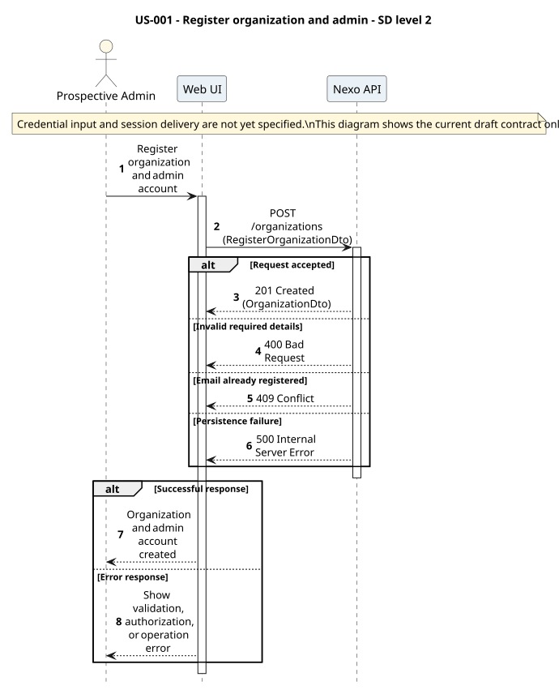
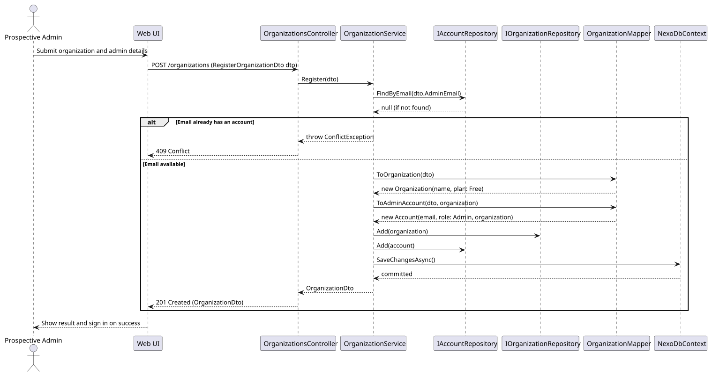

# US-001 - Create an organization and its admin account

[User story design index](../README.md) · [Requirement](../../requirements/US-001-create-organization-admin.md) · [HLD](../../requirements/US-001-HLD.md) · [LLD](../../requirements/US-001-LLD.md)

## Level 1 - SSD

**Actor:** Prospective admin (no account yet).
**Preconditions:** None; this is the entry point.
**Trigger:** The prospective admin submits organization and admin account details.

| Step | Actor input | System response |
| --- | --- | --- |
| 1 | Organization name, admin email, admin name | Validates details and email uniqueness |
| 2 | n/a | Creates the organization (Free plan) and the admin account, signs the admin in |

**Alternative and failure flows:** Missing/invalid fields, or email already in use, reject with no organization or account created.
**Postconditions:** Organization and admin account exist; the admin is signed in.
**Diagram:** 

## Level 2 - SD (coarse)

**Participants:** `Web UI`, `OrganizationsController`.
**Diagram:** 

## Level 3 - SD (detailed)

**Participants:** `OrganizationsController`, `OrganizationService`, `IAccountRepository`, `IOrganizationRepository`, `OrganizationMapper`, `NexoDbContext`.
**Diagram:** 

| Step | Sender → receiver | Operation | Outcome |
| --- | --- | --- | --- |
| 1 | UI → Controller | `POST /organizations` | Delegates to `OrganizationService.Register` |
| 2 | Service → AccountRepository | `FindByEmail` | Checks the admin email is not already in use |
| 3 | Service → Mapper | `ToOrganization`, `ToAdminAccount` | Builds the domain `Organization` (Free plan) and admin `Account` |
| 4 | Service → repositories → DbContext | `Add`, `SaveChangesAsync` | Persists both in one transaction |

**Failure handling:** An email already in use short-circuits before any persistence and returns a conflict to the controller.
**Transaction boundaries:** Organization and admin account are created together in a single `SaveChangesAsync` call; no partial state is possible.
**Related design:** [Architecture](../../architecture/README.md), [Domain model](../../domain-models/README.md#accounts-and-organizations), [ADR-002](../../decisions/ADR-002-modular-monolith-architecture.md).
