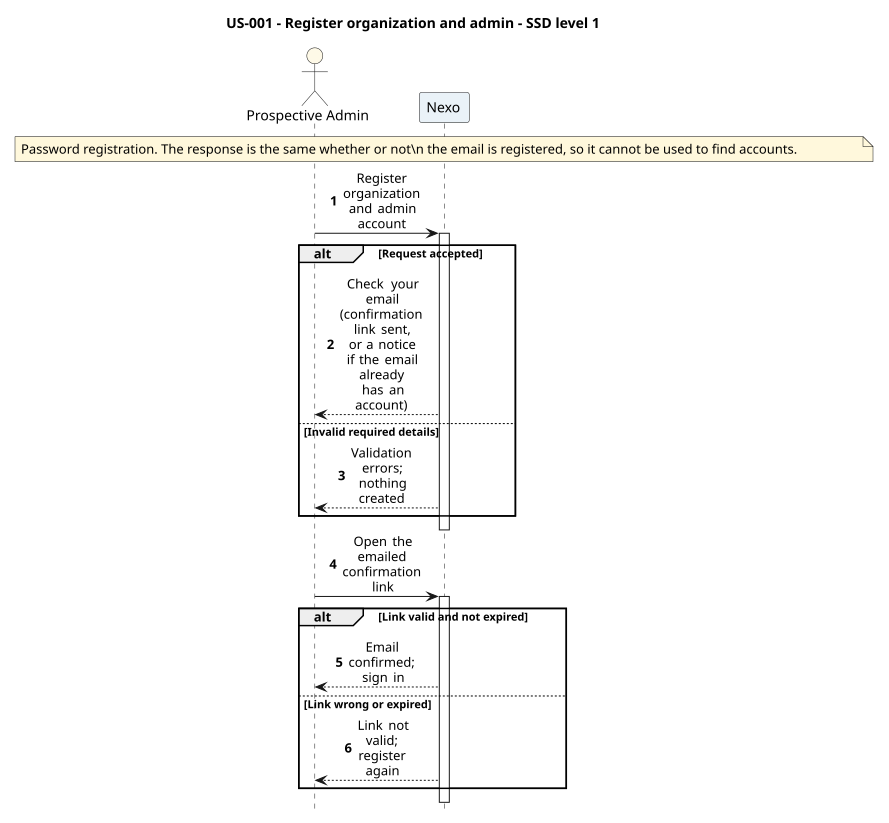
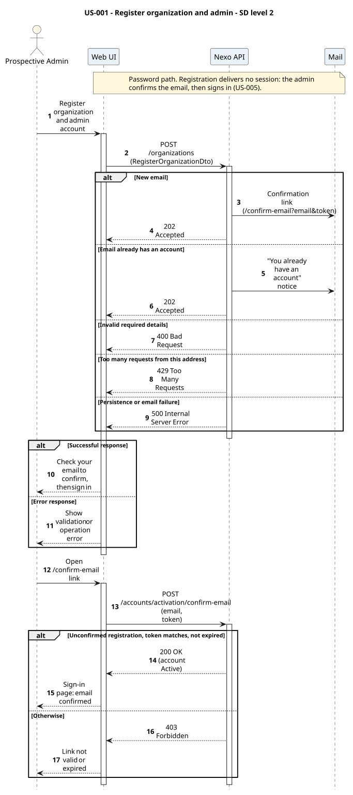
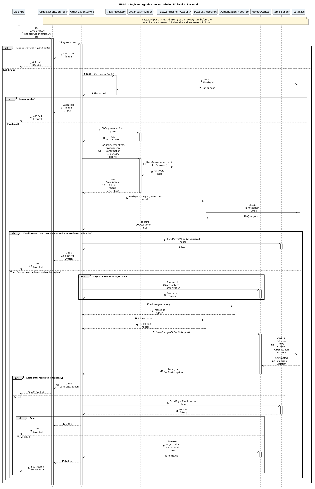
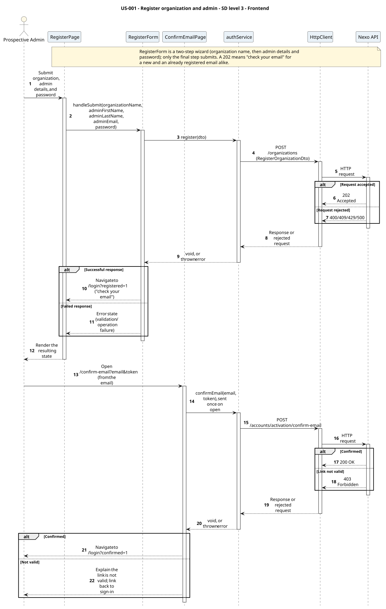

# US-001 - Create an organization and its admin account

[User story design index](../README.md) · [Requirement](../../requirements/US-001-create-organization-admin.md) · [HLD](../../requirements/US-001-HLD.md) · [LLD](../../requirements/US-001-LLD.md)

## Implementation context

**Read:**

1. [Requirement](../../requirements/US-001-create-organization-admin.md)
2. [LLD](../../requirements/US-001-LLD.md)
3. This file (diagrams and levels 1-3)
4. [ADR-002](../../decisions/ADR-002-modular-monolith-architecture.md), [ADR-004](../../decisions/ADR-004-frontend-architecture.md)
5. [Domain model - accounts and organizations](../../domain-models/README.md#accounts-and-organizations)

**Do not read unless needed:** the full domain model, unrelated user stories, other ADRs, global sequence diagrams.

**Open decisions** (see [design-review gaps](../../requirements/README.md#design-review-gaps)):

- Password registration still delivers no session (the admin confirms the email, then signs in); Google registration signs in.

Implementation must not assume answers to these; stop at the `202` contract the diagrams show.

**Status:** implemented. Password registration creates an `Unverified` admin, emails a confirmation link, and redirects to `/login` with a "check your email" notice ([ADR-010](../../decisions/ADR-010-account-security-hardening.md)); Google registration ([LLD](../../requirements/US-001-LLD.md#service-logic-organizationserviceregisterexternal)) signs in and opens the app. The diagrams cover the password path; the Google path is not diagrammed yet. Review the [open contract details](../../requirements/README.md#design-review-gaps) alongside these diagrams.

## Diagram scope

The diagrams cover password registration and the email confirmation that follows it; signing in afterwards is [US-005](../US-005/README.md). The OAuth exchange is not diagrammed.

All diagrams are numbered and use explicit outcome branches. Backend SDs show input validation before reads, EF tracking separately from save, and persistence failure responses where the LLD defines them. Operation tables summarize the collaboration; their row numbers are not diagram message numbers.

## Level 1 - SSD

**Actor:** Prospective admin (no account yet).
**Preconditions:** None; this is the entry point.
**Trigger:** The prospective admin submits organization and admin account details.

| Step | Actor input | System response |
| --- | --- | --- |
| 1 | Organization and admin details | "Check your email" (a confirmation link, or a notice when the email already has an account), or validation errors |
| 2 | Opens the emailed confirmation link | Email confirmed and the admin can sign in, or the link is rejected |

**Alternative and failure flows:** Missing/invalid fields reject with no organization or account created. An email already in use (compared trimmed and case-insensitively) gets the same response as a new one; nothing is created and the owner is emailed a notice. A wrong or expired confirmation link is rejected.
**Postconditions:** Organization and an `Unverified` admin account exist; after confirmation the account is `Active` and the admin can sign in.
**Diagram:** 

## Level 2 - SD (coarse)

**Participants:** `Web UI`, `Nexo API` (the backend, as a whole), `Mail` (the outgoing email).
**Diagram:** 

## Level 3 - Backend

**Participants:** `Web App` (the frontend, as a whole), `OrganizationsController`, `OrganizationService`, `IPlanRepository`, `OrganizationMapper`, `PasswordHasher<Account>`, `IAccountRepository`, `IOrganizationRepository`, `NexoDbContext`, `IEmailSender`, `Database`.
**Diagram:** 

| Step | Sender → receiver | Operation |
| --- | --- | --- |
| 1 | Web App → Controller | `POST /organizations` |
| 2 | Service → PlanRepository | `GetByIdAsync(dto.PlanId)` |
| 3 | Service → Mapper → PasswordHasher | `ToOrganization`, `ToAdminAccount` (`Unverified`, hashes the password, confirmation token hash and expiry) |
| 4 | Service → AccountRepository | `FindByEmailAsync` (normalized email); a taken email gets `AccountEmails.AlreadyRegistered` and a 202 |
| 5 | Service → repositories → DbContext → Database | `Add` (and remove an expired unconfirmed registration), `SaveChangesOrConflictAsync` |
| 6 | Service → EmailSender | `AccountEmails.Confirmation`; on failure the rows are removed again (500) |

See the [LLD service logic](../../requirements/US-001-LLD.md#service-logic-organizationserviceregister) for what each step does and its [error handling](../../requirements/US-001-LLD.md#error-handling) for failure responses. Confirming the email (`AccountActivationService.ConfirmEmail`) is described in the [LLD](../../requirements/US-001-LLD.md#service-logic-accountactivationserviceconfirmemail).

## Level 3 - Frontend

**Participants:** `RegisterPage`, `RegisterForm`, `ConfirmEmailPage`, `authService`, `HttpClient`, `Nexo API` (the backend, as a whole).
**Diagram:** 

| Step | Sender → receiver | Operation | Outcome |
| --- | --- | --- | --- |
| 1 | Actor → View → Component | Submit organization, admin details, and password (final step of the two-step wizard) | View forwards the actor's input to the form component |
| 2 | Component → Service | `authService.register(dto)` | Feature module builds the request |
| 3 | Service → HttpClient | `POST /organizations` | Shared Axios instance sends the request |
| 4 | HttpClient → Nexo API | HTTP request | Reaches the backend (detailed in [Level 3 - Backend](#level-3---backend)) |
| 5 | Actor → ConfirmEmailPage → Service | Open `/confirm-email?email&token`; `authService.confirmEmail` sent once | `POST /accounts/activation/confirm-email`; success goes to `/login?confirmed=1` |

**Failure handling:** A thrown error from the API call propagates back through the service to the component, which renders the validation or conflict message. On success, the component navigates to `/login?registered=1`, which asks the admin to confirm the email before signing in. An invalid confirmation link shows an error with a link back to sign-in.
**Related design:** [Architecture](../../architecture/README.md), [Domain model](../../domain-models/README.md#accounts-and-organizations), [ADR-002](../../decisions/ADR-002-modular-monolith-architecture.md), [ADR-004](../../decisions/ADR-004-frontend-architecture.md).
