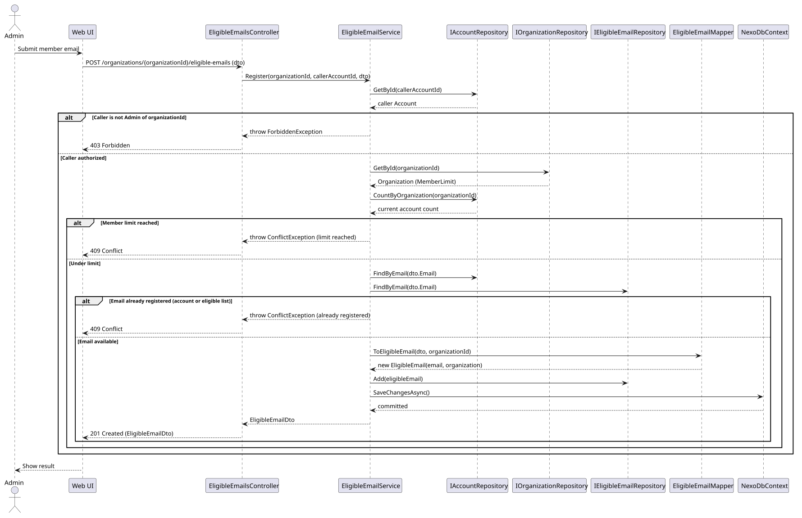

# US-002 - Register a member's email to an organization

[User story design index](../README.md) · [Requirement](../../requirements/US-002-register-member-email.md) · [HLD](../../requirements/US-002-HLD.md) · [LLD](../../requirements/US-002-LLD.md)

## Level 1 - SSD

**Actor:** Admin.
**Preconditions:** The admin has an account (per [US-001](../../requirements/US-001-create-organization-admin.md)) scoped to an organization.
**Trigger:** The admin submits a member's email to register.

| Step | Actor input | System response |
| --- | --- | --- |
| 1 | Member email | Validates the email, the admin's authorization, the plan limit, and uniqueness |
| 2 | n/a | Adds the email to the organization's eligible list |

**Alternative and failure flows:** Invalid email, unauthorized caller, member limit reached, or email already registered elsewhere, reject with no change made.
**Postconditions:** The email is on the organization's eligible list, still without an account.
**Diagram:** 

## Level 2 - SD (coarse)

**Participants:** `Web UI`, `EligibleEmailsController`.
**Diagram:** 

## Level 3 - SD (detailed)

**Participants:** `EligibleEmailsController`, `EligibleEmailService`, `IAccountRepository`, `IOrganizationRepository`, `IEligibleEmailRepository`, `EligibleEmailMapper`, `NexoDbContext`.
**Diagram:** 

| Step | Sender → receiver | Operation | Outcome |
| --- | --- | --- | --- |
| 1 | UI → Controller | `POST /organizations/{organizationId}/eligible-emails` | Delegates to `EligibleEmailService.Register` |
| 2 | Service → AccountRepository | `GetById` | Checks the caller is the organization's admin |
| 3 | Service → OrganizationRepository, AccountRepository | `GetById`, `CountByOrganization` | Checks the member limit is not reached |
| 4 | Service → AccountRepository, EligibleEmailRepository | `FindByEmail` | Checks the email is not already registered |
| 5 | Service → Mapper → repository → DbContext | `ToEligibleEmail`, `Add`, `SaveChangesAsync` | Persists the eligible email |

**Failure handling:** Authorization, limit, and conflict checks each short-circuit before any persistence and return their respective error to the controller.
**Transaction boundaries:** The eligible email is created in a single `SaveChangesAsync` call; no partial state is possible.
**Related design:** [Architecture](../../architecture/README.md), [Domain model](../../domain-models/README.md#accounts-and-organizations), [ADR-002](../../decisions/ADR-002-modular-monolith-architecture.md).
