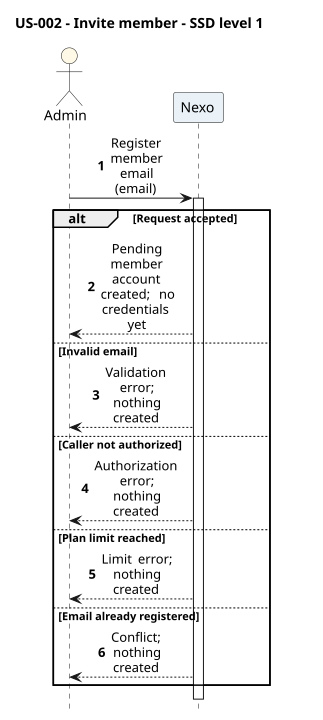
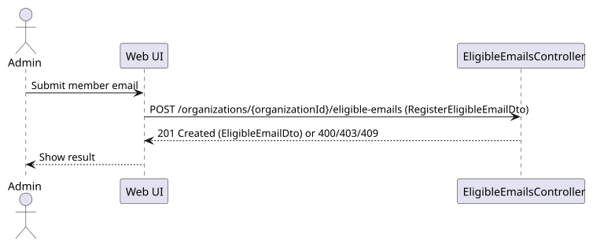
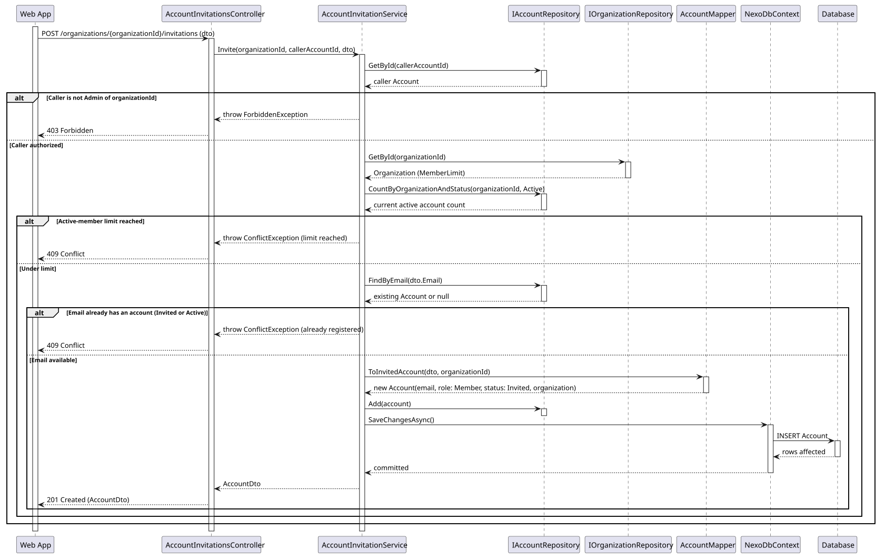
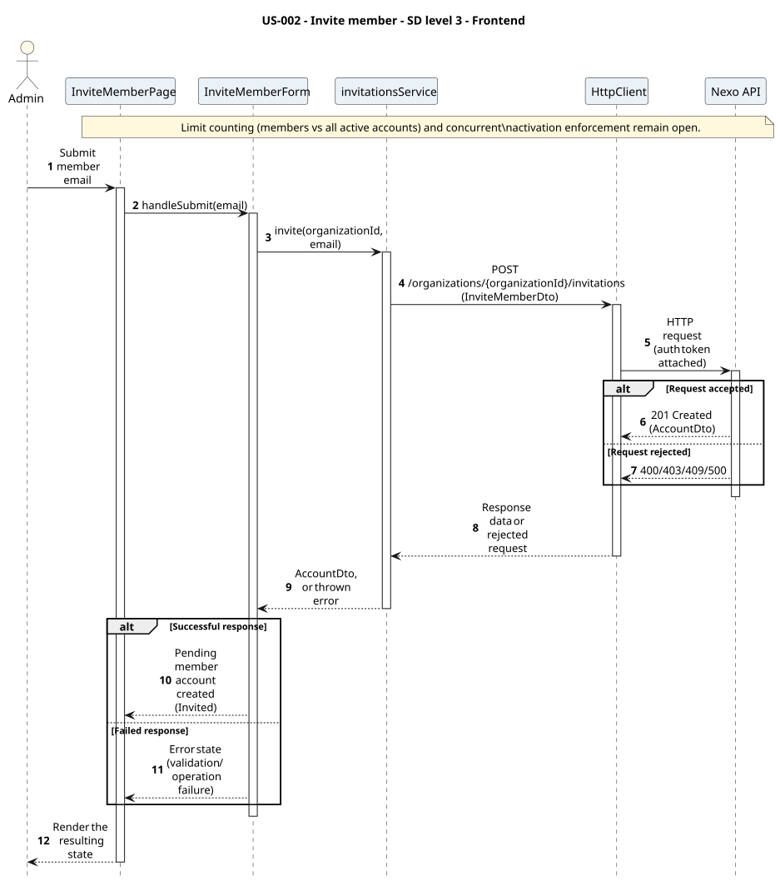

# US-002 - Register a member's email to an organization

[User story design index](../README.md) · [Requirement](../../requirements/US-002-register-member-email.md) · [HLD](../../requirements/US-002-HLD.md) · [LLD](../../requirements/US-002-LLD.md)

**Status:** proposed design; not implemented. Review the [open contract details](../../requirements/README.md#design-review-gaps) alongside these diagrams.

## Diagram scope

The invitation design checks the current Active count before creating an Invited account. Whether admins count, and how activation enforces the limit under concurrency, remain open.

All diagrams are numbered and use explicit outcome branches. Backend SDs show input validation before reads, EF tracking separately from save, and persistence failure responses where the LLD defines them. Operation tables summarize the collaboration; their row numbers are not diagram message numbers.

## Level 1 - SSD

**Actor:** Admin.
**Preconditions:** The admin has an account (per [US-001](../../requirements/US-001-create-organization-admin.md)) scoped to an organization.
**Trigger:** The admin submits a member's email to register.

| Step | Actor input | System response |
| --- | --- | --- |
| 1 | Member email | Pending member account created, or validation/authorization/limit/conflict error |

**Alternative and failure flows:** Invalid email, unauthorized caller, active-member limit reached, or email already registered elsewhere, reject with no change made.
**Postconditions:** A pending (`Invited`) account exists for the email, scoped to the organization, without credentials.
**Diagram:** 

## Level 2 - SD (coarse)

**Participants:** `Web UI`, `Nexo API` (the backend, as a whole).
**Diagram:** 

## Level 3 - Backend

**Participants:** `Web App` (the frontend, as a whole), `AccountInvitationsController`, `AccountInvitationService`, `IAccountRepository`, `IOrganizationRepository`, `AccountMapper`, `NexoDbContext`, `Database`.
**Diagram:** 

| Step | Sender → receiver | Operation | Outcome |
| --- | --- | --- | --- |
| 1 | Web App → Controller | `POST /organizations/{organizationId}/invitations` | Delegates to `AccountInvitationService.Invite` |
| 2 | Service → AccountRepository | `GetByIdAsync` | Checks the caller is the organization's admin |
| 3 | Service → OrganizationRepository, AccountRepository | `GetByIdAsync`, `CountByOrganizationAndStatusAsync(Active)` | Checks the active-member limit is not reached |
| 4 | Service → AccountRepository | `FindByEmailAsync` | Checks the email has no account yet, `Invited` or `Active` |
| 5 | Service → Mapper → repository → DbContext → Database | `ToInvitedAccount`, `Add`, `SaveChangesAsync` | Persists the pending account |

**Failure handling:** Authorization, limit, and conflict checks each short-circuit before any persistence and return their respective error to the controller.
Validation errors return 400 before repository access. A failed save returns 500 with no partial persisted write, as specified in the LLD; the detailed error body remains unspecified. The diagrams show response mapping only after a successful save.

**Transaction boundaries:** The pending account is created in a single `SaveChangesAsync` call; no partial state is possible.

## Level 3 - Frontend

**Participants:** `InviteMemberPage`, `InviteMemberForm`, `invitationsService`, `HttpClient`, `Nexo API` (the backend, as a whole).
**Diagram:** 

| Step | Sender → receiver | Operation | Outcome |
| --- | --- | --- | --- |
| 1 | Actor → View → Component | Submit member email | View forwards the actor's input to the form component |
| 2 | Component → Service | `invitationsService.invite(organizationId, email)` | Feature module builds the request |
| 3 | Service → HttpClient | `POST /organizations/{organizationId}/invitations` | Shared Axios instance sends the request with the caller's token |
| 4 | HttpClient → Nexo API | HTTP request | Reaches the backend (detailed in [Level 3 - Backend](#level-3---backend)) |

**Failure handling:** A thrown 403/409 propagates back through the service to the form, which renders the authorization or conflict message.
**Related design:** [Architecture](../../architecture/README.md), [Domain model](../../domain-models/README.md#accounts-and-organizations), [ADR-002](../../decisions/ADR-002-modular-monolith-architecture.md), [ADR-004](../../decisions/ADR-004-frontend-architecture.md).
