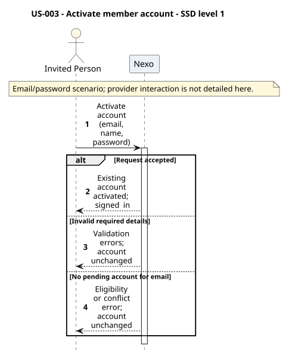
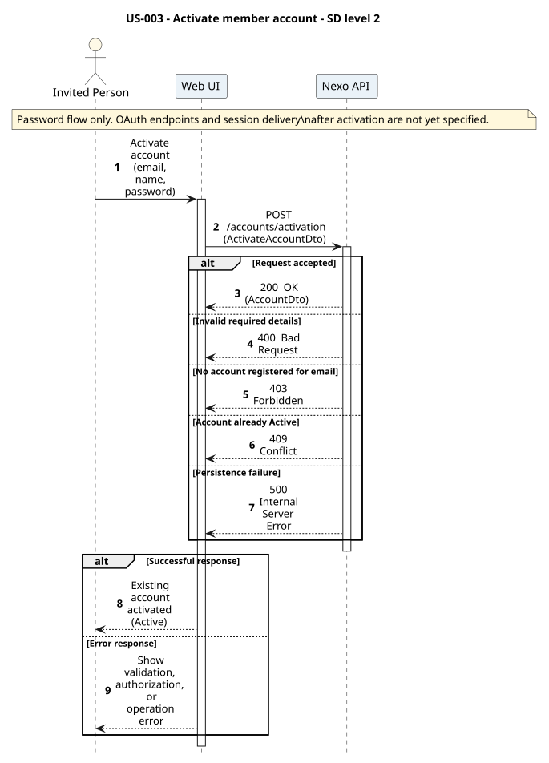
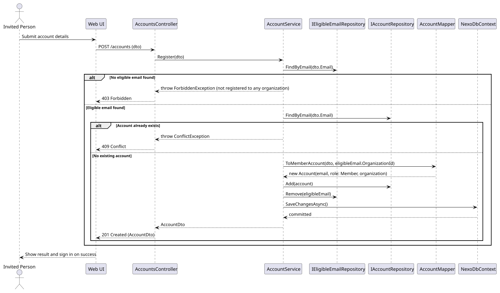

# US-003 - Create a member account

[User story design index](../README.md) · [Requirement](../../requirements/US-003-create-member-account.md) · [HLD](../../requirements/US-003-HLD.md) · [LLD](../../requirements/US-003-LLD.md)

## Level 1 - SSD

**Actor:** Invited person (email registered by an admin, no account yet).
**Preconditions:** The person's email was registered to an organization (per [US-002](../../requirements/US-002-register-member-email.md)) and has no account yet.
**Trigger:** The person submits account details.

| Step | Actor input | System response |
| --- | --- | --- |
| 1 | Email, name, password | Checks the email is registered to an organization and has no account yet |
| 2 | n/a | Creates the member account, signs the person in |

**Alternative and failure flows:** Email not registered to any organization, or email already has an account, reject with no account created.
**Postconditions:** A member account exists scoped to the organization; the person is signed in.
**Diagram:** 

## Level 2 - SD (coarse)

**Participants:** `Web UI`, `AccountsController`.
**Diagram:** 

## Level 3 - SD (detailed)

**Participants:** `AccountsController`, `AccountService`, `IEligibleEmailRepository`, `IAccountRepository`, `AccountMapper`, `NexoDbContext`.
**Diagram:** 

| Step | Sender → receiver | Operation | Outcome |
| --- | --- | --- | --- |
| 1 | UI → Controller | `POST /accounts` | Delegates to `AccountService.Register` |
| 2 | Service → EligibleEmailRepository | `FindByEmail` | Checks the email is registered to an organization |
| 3 | Service → AccountRepository | `FindByEmail` | Checks no account already exists for the email |
| 4 | Service → Mapper | `ToMemberAccount` | Builds the domain `Account` (Member role, hashed password) |
| 5 | Service → repositories → DbContext | `Add`, `Remove`, `SaveChangesAsync` | Persists the account and consumes the eligible email in one transaction |

**Failure handling:** An email not on the eligible list, or already having an account, short-circuits before any persistence and returns its respective error to the controller.
**Transaction boundaries:** The account insert and the eligible-email removal happen in a single `SaveChangesAsync` call; no partial state is possible.
**Related design:** [Architecture](../../architecture/README.md), [Domain model](../../domain-models/README.md#accounts-and-organizations), [ADR-006](../../decisions/ADR-006-authentication.md).
