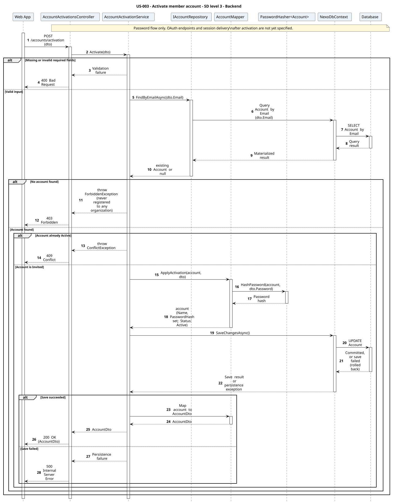
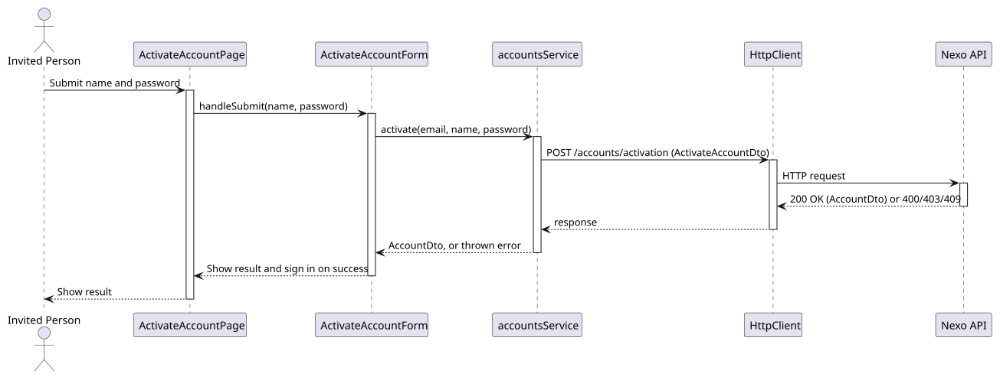

# US-003 - Create a member account

[User story design index](../README.md) · [Requirement](../../requirements/US-003-create-member-account.md) · [HLD](../../requirements/US-003-HLD.md) · [LLD](../../requirements/US-003-LLD.md)

## Implementation context

**Read:**

1. [Requirement](../../requirements/US-003-create-member-account.md)
2. [LLD](../../requirements/US-003-LLD.md)
3. This file (diagrams and levels 1-3)
4. [ADR-006](../../decisions/ADR-006-authentication.md), [ADR-004](../../decisions/ADR-004-frontend-architecture.md)
5. [Domain model - accounts and organizations](../../domain-models/README.md#accounts-and-organizations)
6. [US-002](../../requirements/US-002-register-member-email.md) (precondition: Invited account exists)

**Do not read unless needed:** the full domain model, unrelated user stories, other ADRs, global sequence diagrams.

**Open decisions** (see [design-review gaps](../../requirements/README.md#design-review-gaps)):

- Sign-in after activation is required, but the HLD returns only `AccountDto`; the session response is unspecified.
- Plan-limit counting and concurrency (shared with US-002).

Implementation must not assume answers to these; stop at `AccountDto` as the diagrams show.

**Status:** proposed design; not implemented. Review the [open contract details](../../requirements/README.md#design-review-gaps) alongside these diagrams.

## Diagram scope

The password scenario updates the existing Invited account. The mapper uses PasswordHasher<Account> as specified in the LLD. The SSD includes required sign-in, but SDs stop at AccountDto because session delivery and OAuth endpoints remain unspecified.

All diagrams are numbered and use explicit outcome branches. Backend SDs show input validation before reads, EF tracking separately from save, and persistence failure responses where the LLD defines them. Operation tables summarize the collaboration; their row numbers are not diagram message numbers.

## Level 1 - SSD

**Actor:** Invited person (has a pending, `Invited` account, per [US-002](../../requirements/US-002-register-member-email.md)).
**Preconditions:** The person's email was registered to an organization (per [US-002](../../requirements/US-002-register-member-email.md)) and its account has not been activated yet.
**Trigger:** The person submits account details.

| Step | Actor input | System response |
| --- | --- | --- |
| 1 | Email, name, password | Existing account activated and signed in, or activation rejected |

**Alternative and failure flows:** No account exists for the email, or it is already active, reject with no change made.
**Postconditions:** The account is `Active`, scoped to the organization with the `Member` role; the person is signed in.
**Diagram:** 

## Level 2 - SD (coarse)

**Participants:** `Web UI`, `Nexo API` (the backend, as a whole).
**Diagram:** 

## Level 3 - Backend

**Participants:** `Web App` (the frontend, as a whole), `AccountActivationsController`, `AccountActivationService`, `IAccountRepository`, `AccountMapper`, `PasswordHasher<Account>`, `NexoDbContext`, `Database`.
**Diagram:** 

| Step | Sender → receiver | Operation |
| --- | --- | --- |
| 1 | Web App → Controller | `POST /accounts/activation` |
| 2 | Service → AccountRepository | `FindByEmailAsync` |
| 3 | Service → Mapper | `ApplyActivation` |
| 4 | Service → DbContext → Database | `SaveChangesAsync` |

See the [LLD service logic](../../requirements/US-003-LLD.md#service-logic-accountactivationserviceactivate) for what each step does and its [error handling](../../requirements/US-003-LLD.md#error-handling) for failure responses. The diagrams show response mapping only after a successful save.

## Level 3 - Frontend

**Participants:** `ActivateAccountPage`, `ActivateAccountForm`, `accountsService`, `HttpClient`, `Nexo API` (the backend, as a whole).
**Diagram:** 

| Step | Sender → receiver | Operation | Outcome |
| --- | --- | --- | --- |
| 1 | Actor → View → Component | Submit email, name, and password | View forwards the actor's input to the form component |
| 2 | Component → Service | `accountsService.activate(email, name, password)` | Feature module builds the request |
| 3 | Service → HttpClient | `POST /accounts/activation` | Shared Axios instance sends the request |
| 4 | HttpClient → Nexo API | HTTP request | Reaches the backend (detailed in [Level 3 - Backend](#level-3---backend)) |

**Failure handling:** A thrown 403/409 propagates back through the service to the form, which renders the eligibility or conflict message.
**Related design:** [Architecture](../../architecture/README.md), [Domain model](../../domain-models/README.md#accounts-and-organizations), [ADR-006](../../decisions/ADR-006-authentication.md), [ADR-004](../../decisions/ADR-004-frontend-architecture.md).
