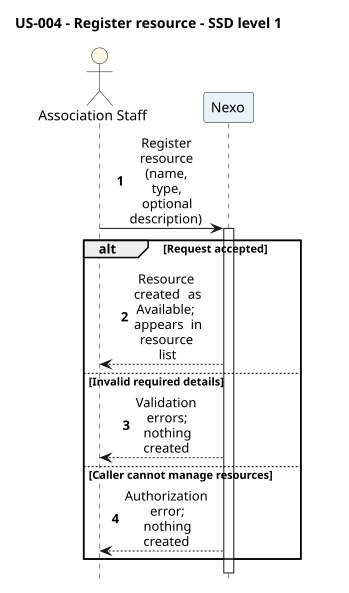
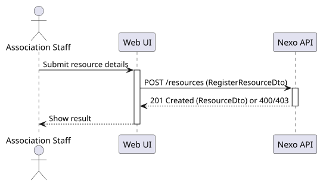
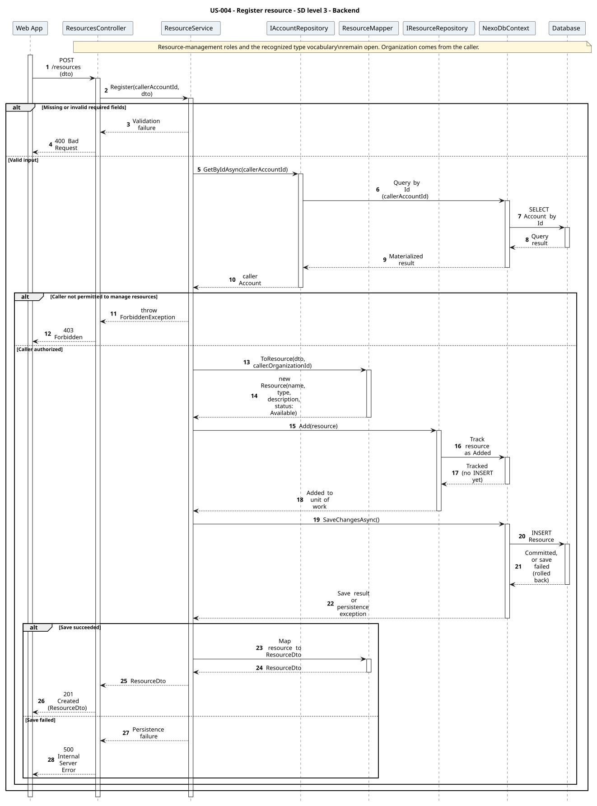
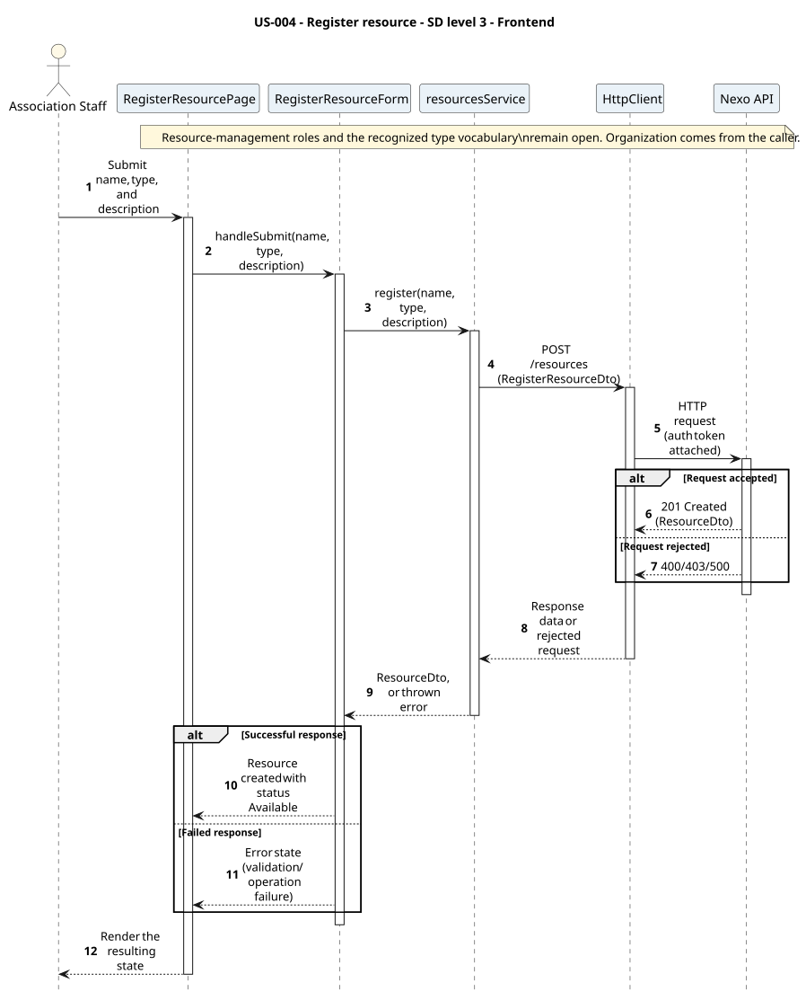

# US-004 - Register a resource

[User story design index](../README.md) · [Requirement](../../requirements/US-004-register-resource.md) · [HLD](../../requirements/US-004-HLD.md) · [LLD](../../requirements/US-004-LLD.md)

**Status:** proposed design; not implemented. Review the [open contract details](../../requirements/README.md#design-review-gaps) alongside these diagrams.

## Diagram scope

OrganizationId comes from the caller. The exact resource-management role and recognized type vocabulary remain open; the diagram does not introduce a Staff role.

All diagrams are numbered and use explicit outcome branches. Backend SDs show input validation before reads, EF tracking separately from save, and persistence failure responses where the LLD defines them. Operation tables summarize the collaboration; their row numbers are not diagram message numbers.

## Level 1 - SSD

**Actor:** Association staff (signed-in account with permission to manage resources).
**Preconditions:** The user has an account (per [US-003](../../requirements/US-003-create-member-account.md)) with permission to manage resources.
**Trigger:** The staff member submits resource details.

| Step | Actor input | System response |
| --- | --- | --- |
| 1 | Name, type, optional description | Available resource created, or validation/authorization error |

**Alternative and failure flows:** Missing/invalid fields, or unauthorized caller, reject with no resource created.
**Postconditions:** The resource exists with status "Available" and appears in the resource list.
**Diagram:** 

## Level 2 - SD (coarse)

**Participants:** `Web UI`, `Nexo API` (the backend, as a whole).
**Diagram:** 

## Level 3 - Backend

**Participants:** `Web App` (the frontend, as a whole), `ResourcesController`, `ResourceService`, `IAccountRepository`, `ResourceMapper`, `IResourceRepository`, `NexoDbContext`, `Database`.
**Diagram:** 

| Step | Sender → receiver | Operation | Outcome |
| --- | --- | --- | --- |
| 1 | Web App → Controller | `POST /resources` | Delegates to `ResourceService.Register` |
| 2 | Service → AccountRepository | `GetByIdAsync` | Checks the caller's permission to manage resources |
| 3 | Service → Mapper | `ToResource` | Builds the domain `Resource` (status Available) |
| 4 | Service → repository → DbContext → Database | `Add`, `SaveChangesAsync` | Persists the resource |

**Failure handling:** An unauthorized caller short-circuits before any persistence and returns a 403 to the controller.
Validation errors return 400 before repository access. A failed save returns 500 with no partial persisted write, as specified in the LLD; the detailed error body remains unspecified. The diagrams show response mapping only after a successful save.

**Transaction boundaries:** The resource is created in a single `SaveChangesAsync` call.

## Level 3 - Frontend

**Participants:** `RegisterResourcePage`, `RegisterResourceForm`, `resourcesService`, `HttpClient`, `Nexo API` (the backend, as a whole).
**Diagram:** 

| Step | Sender → receiver | Operation | Outcome |
| --- | --- | --- | --- |
| 1 | Actor → View → Component | Submit name, type, and description | View forwards the actor's input to the form component |
| 2 | Component → Service | `resourcesService.register(name, type, description)` | Feature module builds the request |
| 3 | Service → HttpClient | `POST /resources` | Shared Axios instance sends the request with the caller's token |
| 4 | HttpClient → Nexo API | HTTP request | Reaches the backend (detailed in [Level 3 - Backend](#level-3---backend)) |

**Failure handling:** A thrown 403 propagates back through the service to the form, which renders the authorization message.
**Related design:** [Architecture](../../architecture/README.md), [Domain model](../../domain-models/README.md#resources), [ADR-002](../../decisions/ADR-002-modular-monolith-architecture.md), [ADR-004](../../decisions/ADR-004-frontend-architecture.md).
