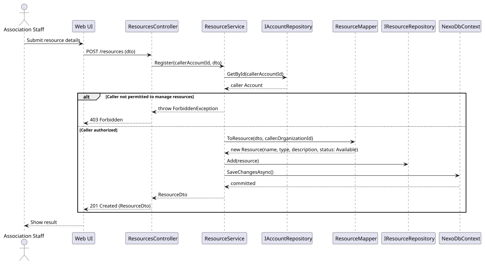

# US-004 - Register a resource

[User story design index](../README.md) · [Requirement](../../requirements/US-004-register-resource.md) · [HLD](../../requirements/US-004-HLD.md) · [LLD](../../requirements/US-004-LLD.md)

## Level 1 - SSD

**Actor:** Association staff (signed-in account with permission to manage resources).
**Preconditions:** The user has an account (per [US-003](../../requirements/US-003-create-member-account.md)) with permission to manage resources.
**Trigger:** The staff member submits resource details.

| Step | Actor input | System response |
| --- | --- | --- |
| 1 | Name, type, description | Validates details and checks permission to manage resources |
| 2 | n/a | Creates the resource with status "Available" |

**Alternative and failure flows:** Missing/invalid fields, or unauthorized caller, reject with no resource created.
**Postconditions:** The resource exists with status "Available" and appears in the resource list.
**Diagram:** 

## Level 2 - SD (coarse)

**Participants:** `Web UI`, `ResourcesController`.
**Diagram:** 

## Level 3 - SD (detailed)

**Participants:** `ResourcesController`, `ResourceService`, `IAccountRepository`, `ResourceMapper`, `IResourceRepository`, `NexoDbContext`.
**Diagram:** 

| Step | Sender → receiver | Operation | Outcome |
| --- | --- | --- | --- |
| 1 | UI → Controller | `POST /resources` | Delegates to `ResourceService.Register` |
| 2 | Service → AccountRepository | `GetById` | Checks the caller's permission to manage resources |
| 3 | Service → Mapper | `ToResource` | Builds the domain `Resource` (status Available) |
| 4 | Service → repository → DbContext | `Add`, `SaveChangesAsync` | Persists the resource |

**Failure handling:** An unauthorized caller short-circuits before any persistence and returns a 403 to the controller.
**Transaction boundaries:** The resource is created in a single `SaveChangesAsync` call.
**Related design:** [Architecture](../../architecture/README.md), [Domain model](../../domain-models/README.md#resources), [ADR-002](../../decisions/ADR-002-modular-monolith-architecture.md).
