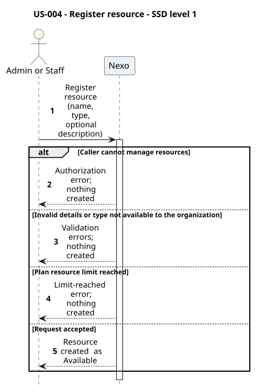
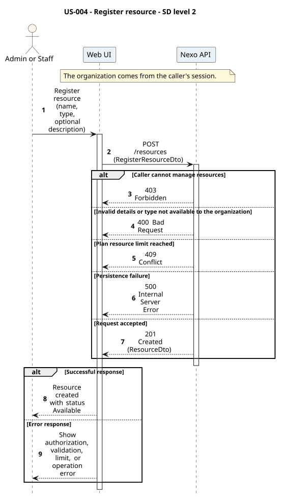
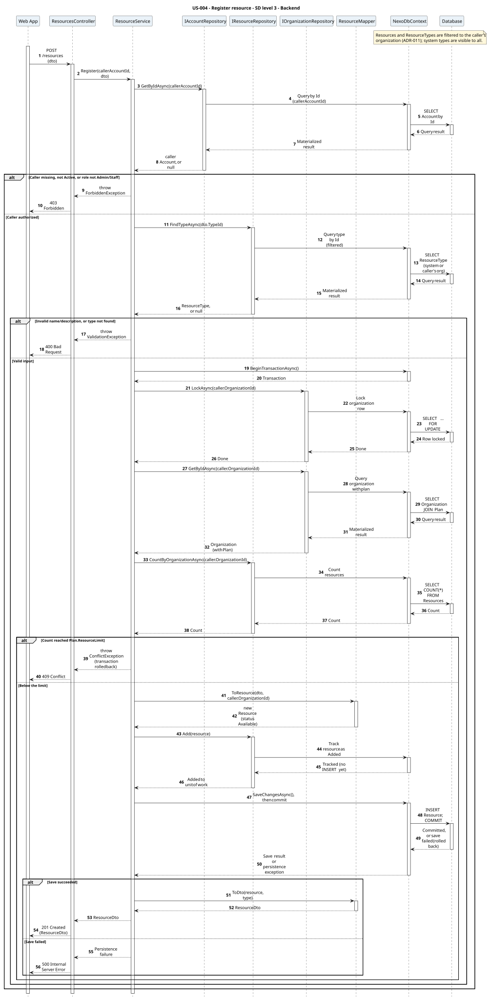
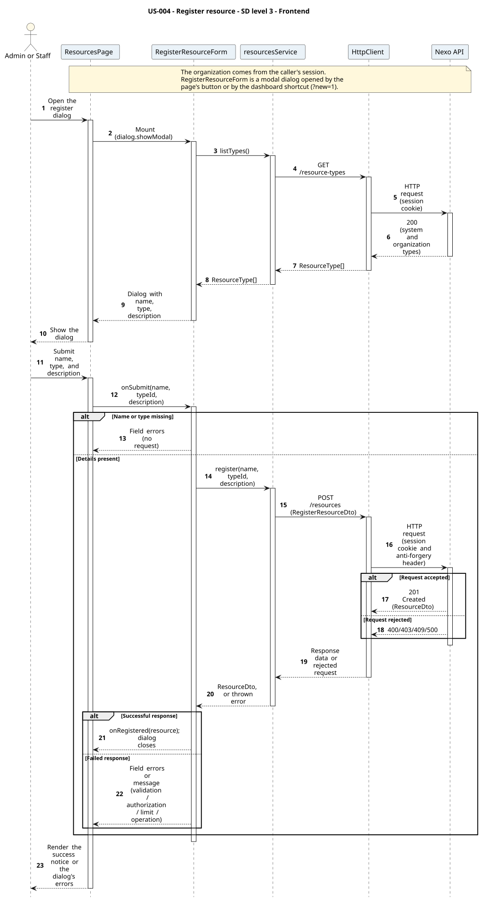

# US-004 - Register a resource

[User story design index](../README.md) · [Requirement](../../requirements/US-004-register-resource.md) · [HLD](../../requirements/US-004-HLD.md) · [LLD](../../requirements/US-004-LLD.md)

## Implementation context

**Read:**

1. [Requirement](../../requirements/US-004-register-resource.md)
2. [LLD](../../requirements/US-004-LLD.md)
3. This file (diagrams and levels 1-3)
4. [ADR-002](../../decisions/ADR-002-modular-monolith-architecture.md), [ADR-004](../../decisions/ADR-004-frontend-architecture.md), [ADR-011](../../decisions/ADR-011-multi-tenancy.md), [ADR-012](../../decisions/ADR-012-resource-types.md)
5. [Domain model - resources](../../domain-models/README.md#resources)
6. [US-002](../../requirements/US-002-register-member-email.md) (staff accounts are invited with the `Staff` role)

**Do not read unless needed:** the full domain model, unrelated user stories, other ADRs, global sequence diagrams.

**Status:** implemented (backend and frontend).

## Diagram scope

The organization comes from the caller's session, never from the request. Admins and staff may register resources; members may not. The permission check runs before input validation, so a caller without permission learns nothing about the field rules. Type validation reads the database, because a type must be a system type or one of the organization's custom types ([ADR-012](../../decisions/ADR-012-resource-types.md)).

All diagrams are numbered and use explicit outcome branches. Backend SDs show repository reads through the context and database, EF tracking separately from save, and persistence failure responses where the LLD defines them. Operation tables summarize the collaboration; their row numbers are not diagram message numbers.

## Level 1 - SSD

**Actor:** Admin or staff (a signed-in `Active` account with role `Admin` or `Staff`).
**Preconditions:** The account belongs to an organization; staff accounts were invited with the `Staff` role (per [US-002](../../requirements/US-002-register-member-email.md)).
**Trigger:** The admin or staff member submits resource details.

| Step | Actor input | System response |
| --- | --- | --- |
| 1 | Name, type, optional description | Available resource created, or authorization/validation/limit error |

**Alternative and failure flows:** An unauthorized caller, missing/invalid fields, a type the organization cannot use, or a reached plan resource limit reject with no resource created.
**Postconditions:** The resource exists in the caller's organization with status "Available".
**Diagram:** 

## Level 2 - SD (coarse)

**Participants:** `Web UI`, `Nexo API` (the backend, as a whole).
**Diagram:** 

## Level 3 - Backend

**Participants:** `Web App` (the frontend, as a whole), `ResourcesController`, `ResourceService`, `IAccountRepository`, `IResourceRepository`, `IOrganizationRepository`, `ResourceMapper`, `NexoDbContext`, `Database`.
**Diagram:** 

| Step | Sender → receiver | Operation |
| --- | --- | --- |
| 1 | Web App → Controller | `POST /resources` |
| 2 | Service → AccountRepository | `GetByIdAsync` (permission check) |
| 3 | Service → ResourceRepository | `FindTypeAsync` (validation) |
| 4 | Service → OrganizationRepository, ResourceRepository | `LockAsync`, `GetByIdAsync`, `CountByOrganizationAsync` (plan limit) |
| 5 | Service → Mapper | `ToResource` |
| 6 | Service → repository → DbContext → Database | `Add`, `SaveChangesAsync`, commit |

See the [LLD service logic](../../requirements/US-004-LLD.md#service-logic-resourceserviceregister) for what each step does and its [error handling](../../requirements/US-004-LLD.md#error-handling) for failure responses.

## Level 3 - Frontend

**Participants:** `ResourcesPage`, `RegisterResourceForm` (a modal dialog), `resourcesService`, `HttpClient`, `Nexo API` (the backend, as a whole). Files are in `web/src/features/resources/`.
**Diagram:** 

| Step | Sender → receiver | Operation | Outcome |
| --- | --- | --- | --- |
| 1 | Actor → View → Component | Open the dialog (button, or `/app/resources?new=1` from the dashboard) | The form mounts and calls `dialog.showModal()` |
| 2 | Component → Service → HttpClient | `resourcesService.listTypes()`, `GET /resource-types` | The type select lists the system types (translated) and the organization's own |
| 3 | Actor → View → Component | Submit name, type, and description | Missing name or type is marked on the field without a request |
| 4 | Component → Service → HttpClient | `resourcesService.register(...)`, `POST /resources` | The shared Axios instance sends the session cookie and anti-forgery header |
| 5 | Component → View | `onRegistered(resource)` | The dialog closes and the page shows a success notice |

**Failure handling:** a 400 puts each server message under its field; 403, 409, and 500 show as a message inside the dialog, which stays open. Members see no register button, only a note that admin and staff register resources.
**Related design:** [Architecture](../../architecture/README.md), [Interface design](../../design/README.md), [Domain model](../../domain-models/README.md#resources), [ADR-002](../../decisions/ADR-002-modular-monolith-architecture.md), [ADR-004](../../decisions/ADR-004-frontend-architecture.md).
