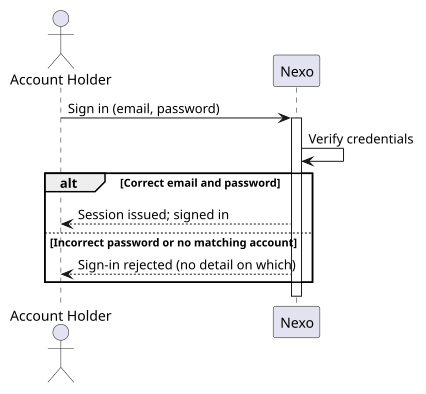
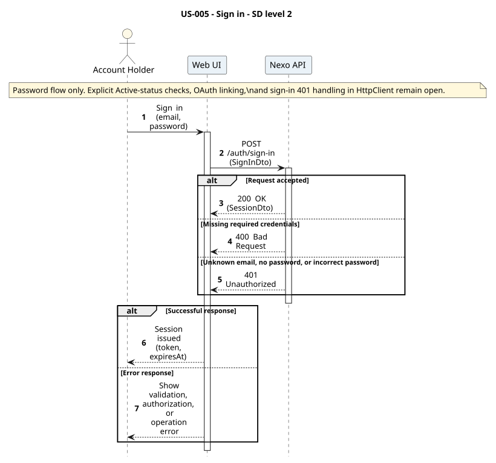
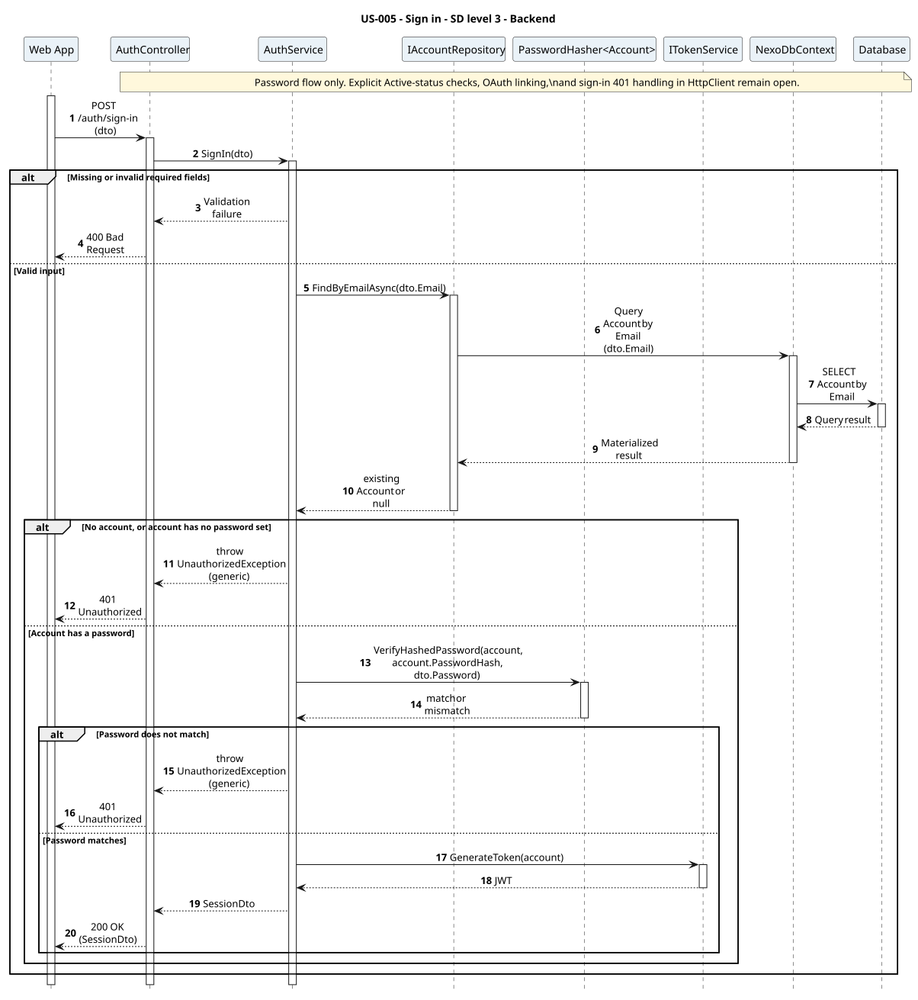
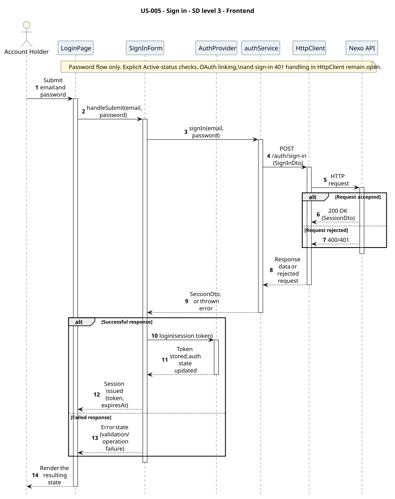

# US-005 - Sign in to an existing account

[User story design index](../README.md) · [Requirement](../../requirements/US-005-sign-in.md) · [HLD](../../requirements/US-005-HLD.md) · [LLD](../../requirements/US-005-LLD.md)

## Implementation context

**Read:**

1. [Requirement](../../requirements/US-005-sign-in.md)
2. [LLD](../../requirements/US-005-LLD.md)
3. This file (diagrams and levels 1-3)
4. [ADR-006](../../decisions/ADR-006-authentication.md), [ADR-004](../../decisions/ADR-004-frontend-architecture.md)
5. [Domain model - accounts and organizations](../../domain-models/README.md#accounts-and-organizations)
6. [US-001](../../requirements/US-001-create-organization-admin.md), [US-003](../../requirements/US-003-create-member-account.md) (account sources)

**Do not read unless needed:** the full domain model, unrelated user stories, other ADRs, global sequence diagrams.

**Open decisions** (see [design-review gaps](../../requirements/README.md#design-review-gaps)):

- Null password hash on invited accounts, not only SSO-only accounts, needs explicit treatment.
- The active-status gate and provider-linking behavior are unspecified.
- The shared HttpClient redirects on every 401, conflicting with the generic-error requirement for sign-in.

Implementation must not assume answers to these; the 401-redirect conflict must be resolved before wiring the form.

**Status:** proposed design; not implemented. Review the [open contract details](../../requirements/README.md#design-review-gaps) alongside these diagrams.

## Diagram scope

The password scenario returns SessionDto and passes its token to AuthProvider.login; see the [sign-in gap](../../requirements/README.md#design-review-gaps) for what remains open, including OAuth linking, the status gate, and the 401-redirect conflict.

All diagrams are numbered and use explicit outcome branches. Backend SDs show input validation before reads, EF tracking separately from save, and persistence failure responses where the LLD defines them. Operation tables summarize the collaboration; their row numbers are not diagram message numbers.

## Level 1 - SSD

**Actor:** Account holder (admin or member, per [US-001](../../requirements/US-001-create-organization-admin.md) or [US-003](../../requirements/US-003-create-member-account.md)).
**Preconditions:** An account already exists.
**Trigger:** The account holder submits email and password.

| Step | Actor input | System response |
| --- | --- | --- |
| 1 | Email and password | Session issued, or validation/generic sign-in error |

**Alternative and failure flows:** Incorrect password, or no matching account, reject without revealing which.
**Postconditions:** The user holds a valid session.
**Diagram:** 

## Level 2 - SD (coarse)

**Participants:** `Web UI`, `Nexo API` (the backend, as a whole).
**Diagram:** 

## Level 3 - Backend

**Participants:** `Web App` (the frontend, as a whole), `AuthController`, `AuthService`, `IAccountRepository`, `NexoDbContext`, `Database`, `PasswordHasher<Account>`, `ITokenService`.
**Diagram:** 

| Step | Sender → receiver | Operation |
| --- | --- | --- |
| 1 | Web App → Controller | `POST /auth/sign-in` |
| 2 | Service → AccountRepository → DbContext → Database | `FindByEmailAsync` |
| 3 | Service → PasswordHasher | `VerifyHashedPassword` |
| 4 | Service → TokenService | `GenerateToken` |

See the [LLD service logic](../../requirements/US-005-LLD.md#service-logic-authservicesignin) for what each step does and its [error handling](../../requirements/US-005-LLD.md#error-handling) for failure responses. Read-only; no persistence changes.

## Level 3 - Frontend

**Participants:** `LoginPage`, `SignInForm`, `AuthProvider`, `authService`, `HttpClient`, `Nexo API` (the backend, as a whole).
**Diagram:** 

| Step | Sender → receiver | Operation | Outcome |
| --- | --- | --- | --- |
| 1 | Actor → View → Component | Submit email and password | View forwards the actor's input to the form component |
| 2 | Component → Service | `authService.signIn(email, password)` | Feature module builds the request |
| 3 | Service → HttpClient | `POST /auth/sign-in` | Shared Axios instance sends the request |
| 4 | HttpClient → Nexo API | HTTP request | Reaches the backend (detailed in [Level 3 - Backend](#level-3---backend)) |

**Failure handling:** The proposed form needs to render the same generic sign-in error for all credential failures. The current shared HttpClient redirects on every 401, so the contract for sign-in failures must be resolved before implementing this interaction.
**Related design:** [Architecture](../../architecture/README.md), [Domain model](../../domain-models/README.md#accounts-and-organizations), [ADR-006](../../decisions/ADR-006-authentication.md), [ADR-004](../../decisions/ADR-004-frontend-architecture.md).
