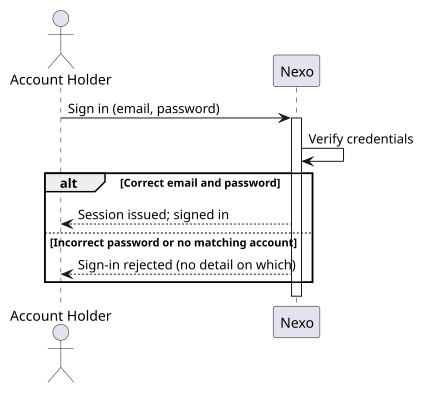
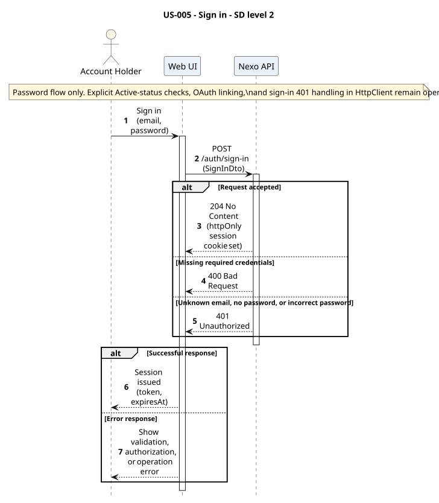
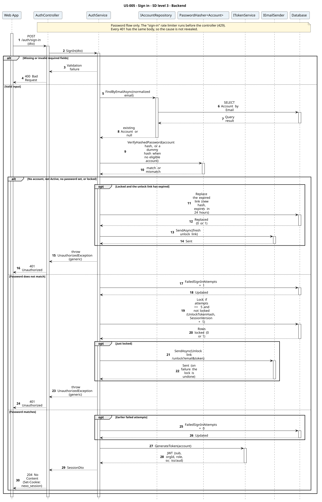
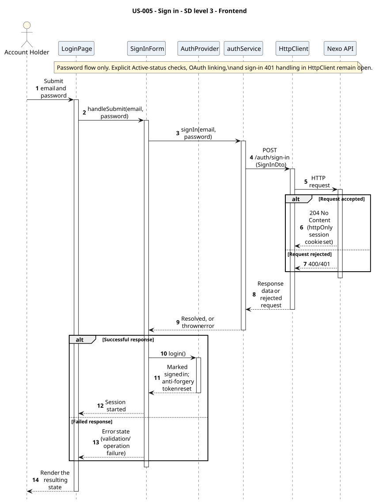

# US-005 - Sign in to an existing account

[User story design index](../README.md) · [Requirement](../../requirements/US-005-sign-in.md) · [HLD](../../requirements/US-005-HLD.md) · [LLD](../../requirements/US-005-LLD.md)

## Implementation context

**Read:**

1. [Requirement](../../requirements/US-005-sign-in.md)
2. [LLD](../../requirements/US-005-LLD.md)
3. This file (diagrams and levels 1-3)
4. [ADR-006](../../decisions/ADR-006-authentication.md), [ADR-004](../../decisions/ADR-004-frontend-architecture.md)
5. [Domain model - accounts and organizations](../../domain-models/README.md#accounts-and-organizations)
6. [US-001](../../requirements/US-001-create-organization-admin.md), [US-003](../../requirements/US-003-create-member-account.md) (account sources)

**Do not read unless needed:** the full domain model, unrelated user stories, other ADRs, global sequence diagrams.

**Open decisions** (see [design-review gaps](../../requirements/README.md#design-review-gaps)):

- Microsoft logins are rejected because Microsoft does not attest email verification.
- The Google flow (`GET /auth/external/{provider}` and its callback) has no sequence diagrams yet; the diagrams below show the password flow.

Resolved: invited accounts (null hash, not `Active`) get the same generic 401 as any credential failure and are never linked to a provider; any 401 marks the session signed out in `AuthProvider` (the route guard then shows `/login` without a page reload), and a failed sign-in still reaches the form.

**Status:** implemented on backend and frontend (password and Google). The diagrams cover the password flow; see the [open contract details](../../requirements/README.md#design-review-gaps).

## Diagram scope

The password scenario answers 204 with the httpOnly session cookie and calls AuthProvider.login() (see [ADR-009](../../decisions/ADR-009-session-cookie.md)); see the [sign-in gap](../../requirements/README.md#design-review-gaps) for what remains open. The Google redirect flow is specified in the [HLD](../../requirements/US-005-HLD.md#api-contract) and [LLD](../../requirements/US-005-LLD.md#service-logic-authservicesigninexternal) but not yet diagrammed.

All diagrams are numbered and use explicit outcome branches. Backend SDs show input validation before reads, EF tracking separately from save, and persistence failure responses where the LLD defines them. Operation tables summarize the collaboration; their row numbers are not diagram message numbers.

## Level 1 - SSD

**Actor:** Account holder (admin or member, per [US-001](../../requirements/US-001-create-organization-admin.md) or [US-003](../../requirements/US-003-create-member-account.md)).
**Preconditions:** An account already exists.
**Trigger:** The account holder submits email and password.

| Step | Actor input | System response |
| --- | --- | --- |
| 1 | Email and password | Session issued, or validation/generic sign-in error |

**Alternative and failure flows:** Incorrect password, or no matching account, reject without revealing which.
**Postconditions:** The user holds a valid session.
**Diagram:** 

## Level 2 - SD (coarse)

**Participants:** `Web UI`, `Nexo API` (the backend, as a whole).
**Diagram:** 

## Level 3 - Backend

**Participants:** `Web App` (the frontend, as a whole), `AuthController`, `AuthService`, `IAccountRepository`, `NexoDbContext`, `Database`, `PasswordHasher<Account>`, `ITokenService`.
**Diagram:** 

| Step | Sender → receiver | Operation |
| --- | --- | --- |
| 1 | Web App → Controller | `POST /auth/sign-in` |
| 2 | Service → AccountRepository → DbContext → Database | `FindByEmailAsync` |
| 3 | Service → PasswordHasher | `VerifyHashedPassword` |
| 4 | Service → TokenService | `GenerateToken` |

See the [LLD service logic](../../requirements/US-005-LLD.md#service-logic-authservicesignin) for what each step does and its [error handling](../../requirements/US-005-LLD.md#error-handling) for failure responses. Read-only; no persistence changes.

## Level 3 - Frontend

**Participants:** `LoginPage`, `SignInForm`, `AuthProvider`, `authService`, `HttpClient`, `Nexo API` (the backend, as a whole).
**Diagram:** 

| Step | Sender → receiver | Operation | Outcome |
| --- | --- | --- | --- |
| 1 | Actor → View → Component | Submit email and password | View forwards the actor's input to the form component |
| 2 | Component → Service | `authService.signIn(email, password)` | Feature module builds the request |
| 3 | Service → HttpClient | `POST /auth/sign-in` | Shared Axios instance sends the request |
| 4 | HttpClient → Nexo API | HTTP request | Reaches the backend (detailed in [Level 3 - Backend](#level-3---backend)) |

**Failure handling:** The form renders the same generic sign-in error for every credential failure (a 401 or 400). A 401 marks the session signed out in `AuthProvider`, so a failed sign-in reaches the form and an expired session goes to `/login` through the route guard.
**Related design:** [Architecture](../../architecture/README.md), [Domain model](../../domain-models/README.md#accounts-and-organizations), [ADR-006](../../decisions/ADR-006-authentication.md), [ADR-004](../../decisions/ADR-004-frontend-architecture.md).
