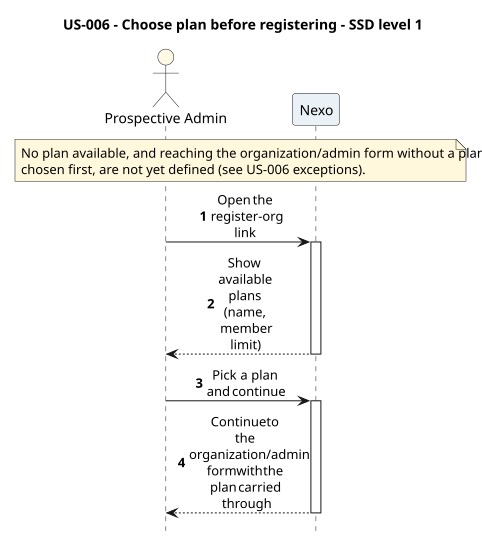
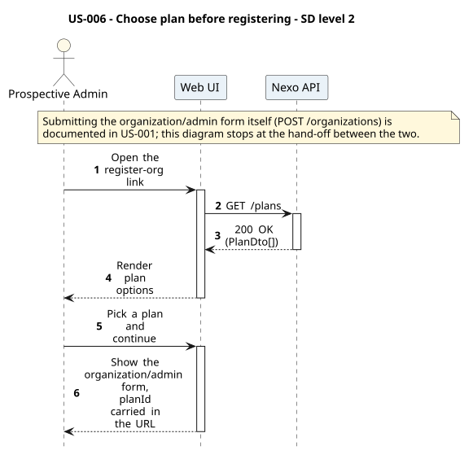
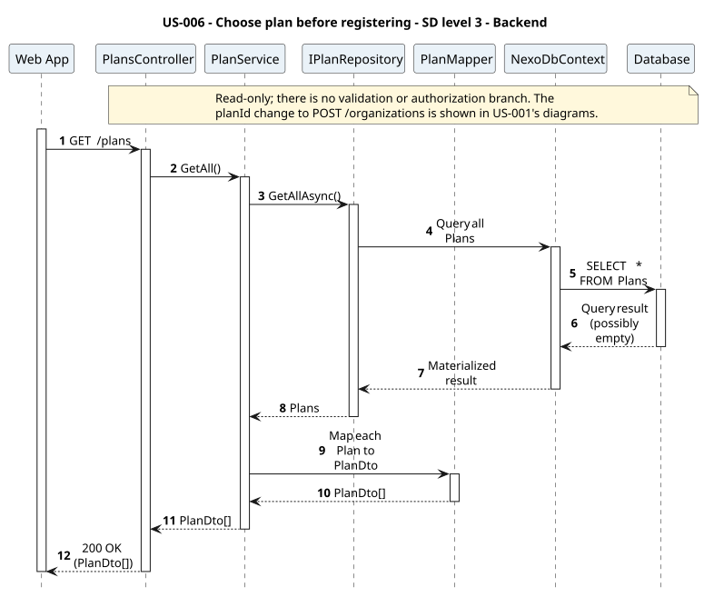
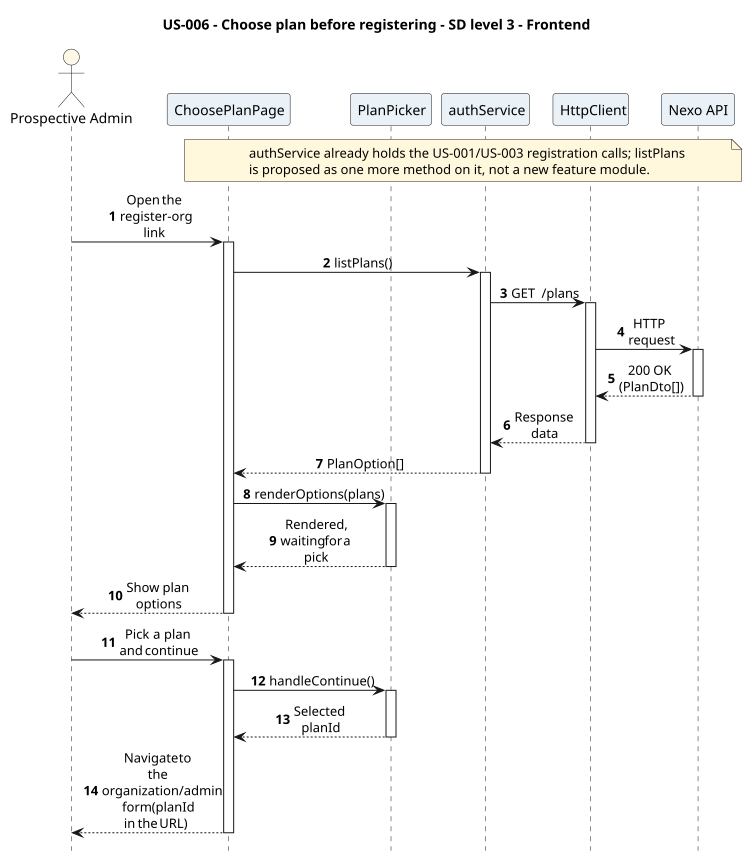

# US-006 - Choose a plan before registering an organization

[User story design index](../README.md) · [Requirement](../../requirements/US-006-choose-plan-before-registering.md) · [HLD](../../requirements/US-006-HLD.md) · [LLD](../../requirements/US-006-LLD.md)

## Implementation context

**Read:**

1. [Requirement](../../requirements/US-006-choose-plan-before-registering.md)
2. [LLD](../../requirements/US-006-LLD.md)
3. This file (diagrams and levels 1-3)
4. [ADR-002](../../decisions/ADR-002-modular-monolith-architecture.md), [ADR-004](../../decisions/ADR-004-frontend-architecture.md)
5. [Domain model - accounts and organizations](../../domain-models/README.md#accounts-and-organizations)
6. [US-001](../../requirements/US-001-create-organization-admin.md) (the form this story hands off to, and whose contract it changes)

**Do not read unless needed:** the full domain model, unrelated user stories, other ADRs, global sequence diagrams.

**Open decisions** (see [design-review gaps](../../requirements/README.md#design-review-gaps)):

- What happens when no plans are seeded, or the organization/admin form is reached directly without a plan chosen first.
- This story requires a required `planId` on US-001's already-implemented `RegisterOrganizationDto`, replacing its hardcoded "Free" plan lookup.

Implementation must not assume answers to these.

**Status:** proposed design; not implemented. Review the [open contract details](../../requirements/README.md#design-review-gaps) alongside these diagrams.

## Diagram scope

`GET /plans` is a plain read with no validation or authorization branch. The plan hand-off to the organization/admin form is shown as a URL-carried `planId`; that form's own submission (`POST /organizations`) is documented in [US-001](../US-001/README.md), not repeated here.

All diagrams are numbered and use explicit outcome branches where one exists. Backend SDs show input validation before reads, EF tracking separately from save, and persistence failure responses where the LLD defines them. Operation tables summarize the collaboration; their row numbers are not diagram message numbers.

## Level 1 - SSD

**Actor:** Prospective admin (no account yet).
**Preconditions:** none.
**Trigger:** The person opens the register-org link.

| Step | Actor input | System response |
| --- | --- | --- |
| 1 | Open the register-org link | Available plans shown (name, member limit) |
| 2 | Pick a plan and continue | Organization/admin form shown, with the plan carried through |

**Alternative and failure flows:** not yet defined (see [US-006 exceptions](../../requirements/US-006-choose-plan-before-registering.md)).
**Postconditions:** the person is on the organization/admin form with a plan selected; no organization exists yet.
**Diagram:** 

## Level 2 - SD (coarse)

**Participants:** `Web UI`, `Nexo API` (the backend, as a whole).
**Diagram:** 

## Level 3 - Backend

**Participants:** `Web App` (the frontend, as a whole), `PlansController`, `PlanService`, `IPlanRepository`, `PlanMapper`, `NexoDbContext`, `Database`.
**Diagram:** 

| Step | Sender → receiver | Operation |
| --- | --- | --- |
| 1 | Web App → Controller | `GET /plans` |
| 2 | Service → PlanRepository | `GetAllAsync` |
| 3 | Service → Mapper | Map each `Plan` to `PlanDto` |

See the [LLD service logic](../../requirements/US-006-LLD.md#service-logic-planservicegetall) for what each step does. This diagram covers `GET /plans` only; the `planId` change to `POST /organizations` is [US-001's](../US-001/README.md#level-3---backend) diagram to update once accepted.

## Level 3 - Frontend

**Participants:** `ChoosePlanPage`, `PlanPicker`, `authService`, `HttpClient`, `Nexo API` (the backend, as a whole).
**Diagram:** 

| Step | Sender → receiver | Operation | Outcome |
| --- | --- | --- | --- |
| 1 | Actor → View | Open the register-org link | View asks the service for plans |
| 2 | View → Service | `authService.listPlans()` | Feature module fetches available plans |
| 3 | Service → HttpClient | `GET /plans` | Shared Axios instance sends the request |
| 4 | HttpClient → Nexo API | HTTP request | Reaches the backend (detailed in [Level 3 - Backend](#level-3---backend)) |
| 5 | Actor → View | Pick a plan and continue | View reads the pick from the component and navigates, `planId` in the URL |

**Related design:** [Architecture](../../architecture/README.md), [Domain model](../../domain-models/README.md#accounts-and-organizations), [ADR-002](../../decisions/ADR-002-modular-monolith-architecture.md), [ADR-004](../../decisions/ADR-004-frontend-architecture.md).
